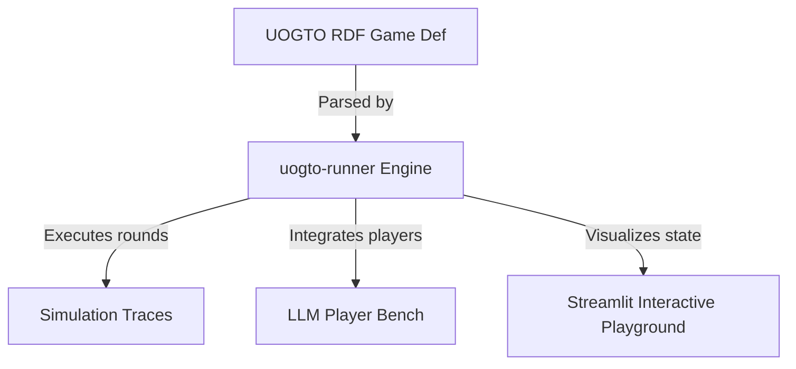

# Specification: Executable Simulation Runner and Interactive Playground (`executable_simulation_visualizer_20260621`)

## Overview
This track implements execution semantics and visualization interfaces for UOGTO. It builds a Python-based RDF game runner (`uogto-runner`) that simulates games defined in graphs, an interactive Streamlit-based playground showing state graphs and SHACL validation results, and an LLM-as-a-Player evaluation benchmark.

## System Design

## MoSCoW Prioritization

### Must Have
- **RDF Game Runner (`uogto-runner`)**: Python simulation runtime parsing payoffs, strategies, and transition states directly from RDF graphs.
- **Streamlit Interactive Playground**: Dashboard to upload Turtle graphs, run SHACL checks, and inspect game graph topologies.

### Should Have
- **LLM-as-a-Player Test Bench**: Evaluates LLM agents (APIs/local models) in UOGTO-defined game scenarios, saving actions as event traces.
- **Visual Node-Link Diagrams**: Graphs rendering of game trees and state transitions.

### Could Have
- **Multi-agent Game Simulation Templates**: Pre-configured configurations for classic environments.

### Won't Have
- **Real-time 3D Graphics**: Strictly limited to 2D network node graphs and tables.

## Acceptance Criteria
- [x] Runner parses and executes a standard NormalFormGame or MarkovGame graph.
- [x] Streamlit interface successfully displays graph statistics, nodes, and SHACL compliance.
- [x] LLM agent can act as a player in a simulated round with recorded event output.
