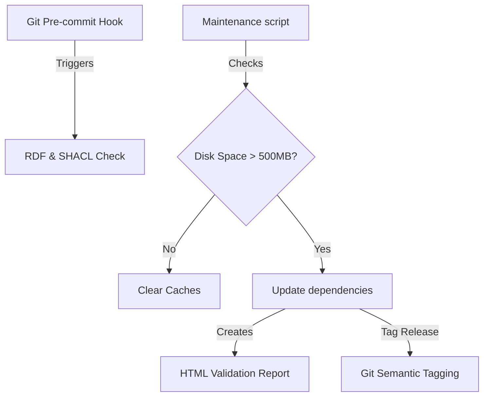

# Specification: Repository Maintenance and Validation Enhancements (`maintenance_improvements_20260621`)

## Overview
This track implements advanced improvements to the UOGTO repository maintenance automation stack. It introduces protective disk space checking, automated git semantic release tagging, secure token authentication for remote status checks, HTML SHACL validation reports, and git pre-commit hooks.

## System Design

## MoSCoW Prioritization

### Must Have
- **Disk Space Pre-check**: Integration of C-drive free space queries and cache clearance logic into maintenance tools.
- **Git Pre-commit Hook**: Configured local pre-commit hook enforcing `make validate` before commits are processed.
- **GITHUB_TOKEN integration**: Support fetching issues/PRs using token authorization.
- **Semantic Completeness Audit**: Script verifying that every class/property has `rdfs:label` and `skos:definition`.

### Should Have
- **Semantic Tagging**: Automated tagging (`vX.Y.Z`) on successful releases.
- **HTML SHACL Report**: Export validation failure/success reports in human-friendly HTML structure.
- **Lockfile Vulnerability Audit**: Automated verification of dependencies in `pixi.lock` against vulnerability databases.

### Could Have
- **JSON-LD Schema Staging**: Automated building and copying of schema assets to static pages folder.

### Won't Have
- **Automated Dependency Merging**: Automatic PR generation for dependency updates.

## Acceptance Criteria
- [x] Pre-commit hook blocks invalid commits and passes valid ones.
- [x] Disk checker logs status and cleans cache if space is low.
- [x] Check script successfully queries authenticated REST endpoints using `GITHUB_TOKEN`.
- [x] Release tagging script successfully updates tags.
- [x] HTML validation report output is generated.
