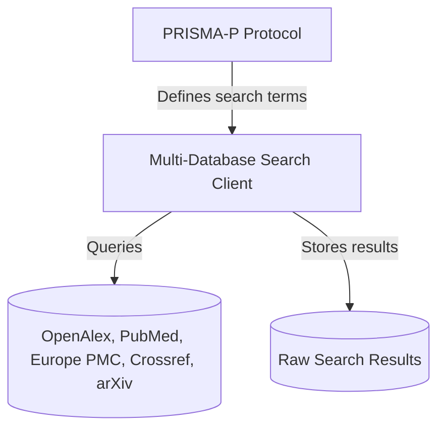

# Specification: Scoping Review Protocol Development (`scoping_review_protocol_20260621`)

## Overview
This track details the protocol setup and client search scaffolding for the UOGTO scoping review. It documents the systematic criteria for identifying game models, variables, and payoffs in academic databases, following PRISMA-P (Protocol) and PRISMA-S (Search) standards. It also develops the multi-database querying client.

## System Design

## MoSCoW Prioritization

### Must Have
- **PRISMA-P Protocol Document**: Defines eligibility criteria, databases, target indices, and exclusion rules.
- **PRISMA-S Search Strategy**: Outlines specific boolean search strings, limits, and syntax mappings.
- **Multi-Database API Client**: Python tool to query PubMed, Crossref, arXiv, Europe PMC, and OpenAlex.

### Should Have
- **Interactive Search Configurator**: Allows configuring search queries via a local config file.

### Could Have
- **Dry-run Search Validator**: Computes expected results sizing before downloading full datasets.

### Won't Have
- **Deduplication and Filtering**: Deferred to the review execution phase.

## Acceptance Criteria
- [ ] PRISMA-P protocol written in `docs/review/protocol.md`.
- [ ] PRISMA-S search strings documented for all target indices.
- [ ] Search client downloads and saves query results to `data/raw/` in structured JSON format.
