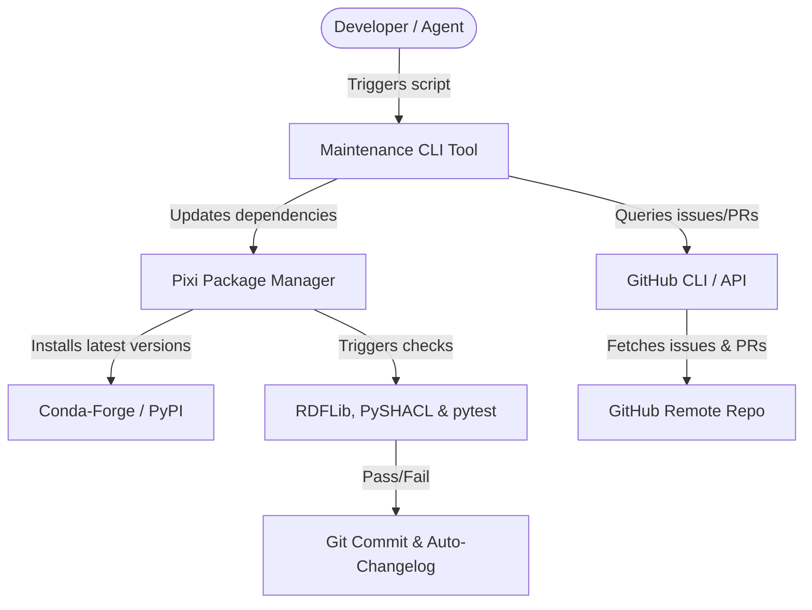

# Specification: Repository Maintenance and Remote Automation (`repo_maintenance_20260621`)

## Overview
This track defines and implements the custom skills, tools, workflows, and agent specifications required for automated repository maintenance of the UOGTO project. It focuses on keeping dependencies bleeding edge (using Pixi), checking remote issues and PRs (agentic/GitHub CLI), validating repository integrity (via tests/SHACL), and generating release artifacts and changelogs.

## System Design

## MoSCoW Prioritization

### Must Have (Essential)
- **Pixi Dependency Upgrader**: Automated script to safely update packages to bleeding edge.
- **Repository Health Checker**: Runs tests, RDFLib parses, and SHACL validation post-upgrade.
- **Task Committing**: Automatic git committing of updates upon validation success.

### Should Have (Important but not vital)
- **GitHub Issues/PR Checker**: Script using `gh` CLI or fallback API to generate a structured issues summary.
- **Auto-Changelog Generator**: Formats commit history into clean markdown changelogs.

### Could Have (Nice to have)
- **CI/CD Integration**: A `.github/workflows/maintenance.yml` trigger for automated schedule-based runs.
- **Custom Agent Skill**: Custom Antigravity skill mapping to ease subagent delegation.

### Won't Have (Deferred)
- **Auto-merging PRs**: Automatic merging of remote pull requests without developer review.

## Acceptance Criteria
- [x] Pixi-based dependency check and update scripts are functional.
- [x] GitHub CLI / agent integration for remote issue and PR queries functions and creates summary files.
- [x] A Makefile target or custom task validates repository health post-maintenance.
- [x] Auto-changelog generation tool outputs correct Markdown format.
- [x] Test cases run successfully on the new maintenance scripts.
