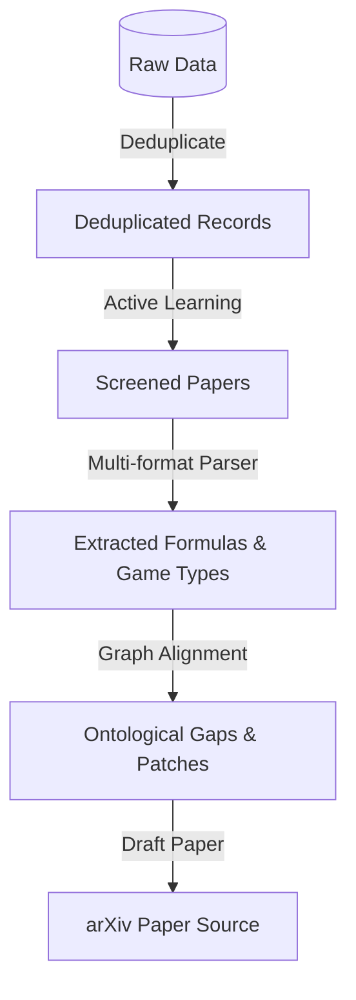

# Specification: Scoping Review Execution and arXiv Manuscript (`scoping_review_execution_paper_20260621`)

## Overview
This track covers the execution phase of the systematic literature review and the drafting of the final scoping paper. It deduplicates raw search data, filters records using active learning, extracts game forms and formulas (LaTeX, MathML, Quarto, Typst), maps coverage/gaps to UOGTO, and compiles the LaTeX manuscript describing the ontology for arXiv submission.

## System Design

## MoSCoW Prioritization

### Must Have
- **Deduplication Engine**: Cleans overlapping database results via DOI/title matching.
- **Active Learning Screening Loop**: Ranker prioritizing abstracts based on screening decisions.
- **Multi-format Math Parser**: Extracts LaTeX, MathML, Quarto, and Typst equation blocks.
- **L2O Graph Verification**: Automatically aligns literature findings with UOGTO classes and output gaps.
- **arXiv Paper Draft**: LaTeX manuscript describing UOGTO ontology design, scoping review findings, and verification.

### Should Have
- **Snowballing Expansion**: Auto-queries citation networks via OpenAlex.
- **Temporal Drift Calibration**: Terminological adjustments across historical eras.
- **RDF Ontological Patch Generator**: Automatically drafts Turtle (.ttl) class extensions.
- **Payoff Matrix OCR**: Extracts grids from PDF page images/tables.

### Could Have
- **Interactive Review Dashboard**: Markdown UI to track paper classifications.

### Won't Have
- **Direct journal upload**: Automated submission to journals (strictly compiles locally for arXiv).

## Acceptance Criteria
- [x] Deduplication cleans overlapping records.
- [x] Active learning screenings and math parsing function correctly.
- [x] Ontological mapping report generates clear gaps table.
- [x] Turtle patches generated for all gaps.
- [x] arXiv paper drafted at `docs/paper/paper.tex`.
