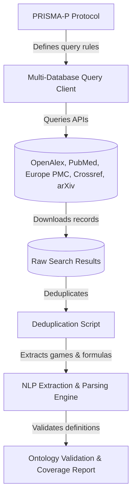

# Specification: Systematic and Scoping Literature Review Pipeline (`systematic_literature_review_20260621`)

## Overview
This track implements a systematic scoping review pipeline to validate UOGTO's coverage of game theory structures, definitions, and formulas using empirical academic literature. Guided by PRISMA-P and PRISMA-S protocols, it queries multiple databases (PubMed, OpenAlex, Crossref, arXiv, Europe PMC, etc.), deduplicates records, applies NLP models to isolate game structures, and validates ontology coverage.

## System Design

## MoSCoW Prioritization

### Must Have
- **PRISMA Review Protocol**: Methodological protocol file defining eligibility, search terms, and screening criteria.
- **Multi-Database API Query Client**: Automated Python script to download search hits from Crossref, PubMed, Europe PMC, arXiv, and OpenAlex.
- **Record Deduplication Utility**: Python script using DOI/title matching to clean overlapping database results.
- **UOGTO Coverage Mappings**: Automated reporting validating UOGTO terms against identified games and formulas.
- **Literature-to-Ontology (L2O) Graph**: Represents literature nodes in temporary RDF for SPARQL-based coverage alignment.

### Should Have
- **NLP Concept Classifier**: Script using TF-IDF/embeddings or regex rules to flag candidate game forms, payoff matrix strings, and parameters.
- **Active Learning Screening Loop**: Ranker learning developer eligibility choices to prioritize relevant abstracts.
- **Multi-format Equation Parser**: Extracts LaTeX, MathML, Quarto, and Typst mathematical representations from text fields.
- **Semantic Embedding Clustering**: Vectors-based clustering of abstracts using sentence-transformers to identify hidden game forms.
- **Formula Triangulation**: Parser comparing identified mathematical game equations against target ontological classifications.
- **Automated Snowballing Search**: Script querying citation networks (forward/backward) via OpenAlex to expand search.
- **Temporal Semantic Drift Detection**: Adjusts terminology classification boundaries across historical publication eras.
- **RDF Ontological Patch Generator**: LLM/template-assisted generator drafting Turtle (.ttl) class structures for identified gaps.

### Could Have
- **Interactive Review Dashboard**: Simple markdown or web-based UI to browse extracted articles and their mapping status.

### Won't Have
- **Fully Automated PDF Article Downloader**: Downloading full-text PDFs (due to publisher firewalls and licensing limits).

## Acceptance Criteria
- [ ] Systematic review protocol documented using PRISMA-P guidelines.
- [ ] Multi-database search script successfully downloads structured JSON/CSV data.
- [ ] Deduplication logic matches and resolves duplicate records.
- [ ] NLP extraction logic isolates candidate games and variables from abstracts.
- [ ] Ontological mapping report generates coverage matrices for UOGTO.
