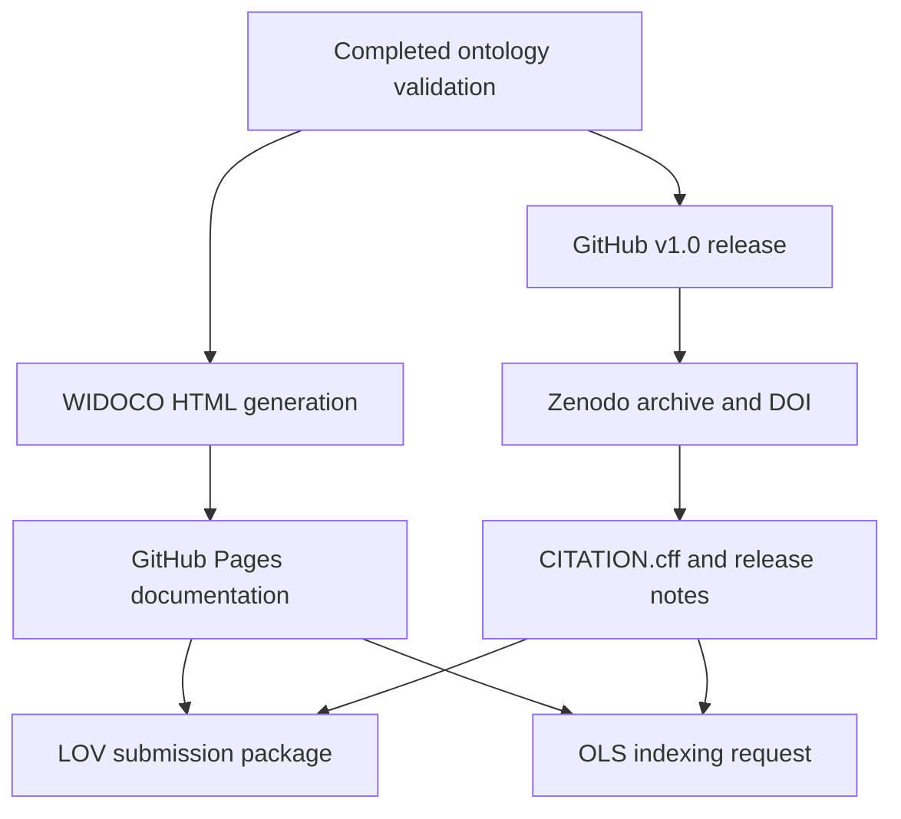

# Specification: Publishing and Discoverability (`uogto_publishing_discoverability_20260622`)

## Overview
This track extends the UOGTO project plan after the completed ontology modeling, SHACL validation, examples, competency queries, and repository maintenance phases. It defines the remaining release-publication work required to make UOGTO citable, human-readable, and discoverable through Semantic Web registries and ontology indexing services.

## Scope
- Configure DOI archiving through Zenodo for GitHub releases.
- Generate and publish human-readable ontology documentation through WIDOCO and GitHub Pages.
- Prepare and submit the ontology to Linked Open Vocabularies (LOV).
- Prepare and request indexing by the Ontology Lookup Service (OLS).

## Out of Scope
- Changing ontology semantics solely to satisfy registry preferences without a separate ontology-design review.
- Publishing a release that fails local RDFLib, SHACL, competency-query, and pytest gates.
- Manual DOI minting outside the GitHub release and Zenodo integration flow unless the automated integration is unavailable.

## System Design

## Required Configuration and Planning Files
- `CITATION.cff`
- `.zenodo.json`
- `docs/releases/v1.0.md`
- `.github/workflows/widoco-pages.yml`
- `docs/widoco/widoco.properties`
- `docs/widoco/README.md`
- `docs/registry/lov-submission.md`
- `docs/registry/ols-indexing.md`
- `docs/registry/metadata-checklist.md`

## Acceptance Criteria
- [ ] Zenodo is linked to the GitHub repository and a v1.0 release mints a DOI.
- [ ] `CITATION.cff` and `.zenodo.json` validate against their expected schemas and match the release metadata.
- [ ] WIDOCO documentation is generated automatically in CI from canonical ontology files.
- [ ] GitHub Pages publishes the generated WIDOCO HTML for the current release.
- [ ] LOV metadata requirements are documented, checked, and ready for formal submission.
- [ ] OLS compatibility requirements are documented, checked, and ready for inclusion request.
- [ ] `make validate` and `make test` pass before any publishing or registry submission step.
