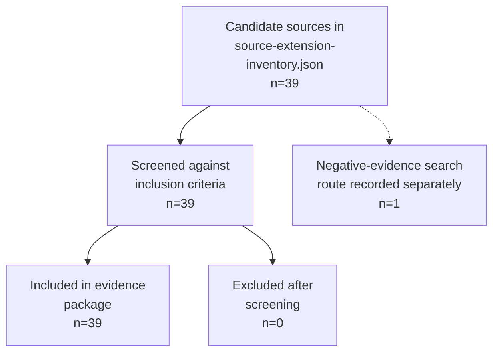

# PRISMA 2020-style screening flow

Screening, inclusion, exclusion, and negative-evidence disposition for the UOGTO article-hardening source register.

```mermaid
flowchart TD
    N0["Candidate sources in<br/>source-extension-inventory.json<br/>n=39"]
    N1["Screened against<br/>inclusion criteria<br/>n=39"]
    N2["Included in evidence<br/>package<br/>n=39"]
    N3["Excluded after<br/>screening<br/>n=0"]
    N4["Negative-evidence search<br/>route recorded separately<br/>n=1"]
    N0 --> N1
    N1 --> N2
    N1 --> N3
    N0 -.-> N4
```
