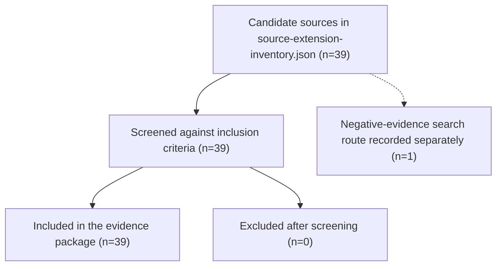

# PRISMA 2020 Screening Flow

This figure adapts the PRISMA 2020 flow-diagram template for the UOGTO article-hardening screening stage. Counts reflect the current repository snapshot on 2026-06-25 and are derived from `docs/article-hardening/source-extension-inventory.json`.

Notes:
- The screening flow remains PRISMA 2020-style, but the object of screening is ontology and evidence-package sources rather than study records.
- The zero-exclusion branch reflects the current package state, where all inventory entries are retained for synthesis and article preparation.
