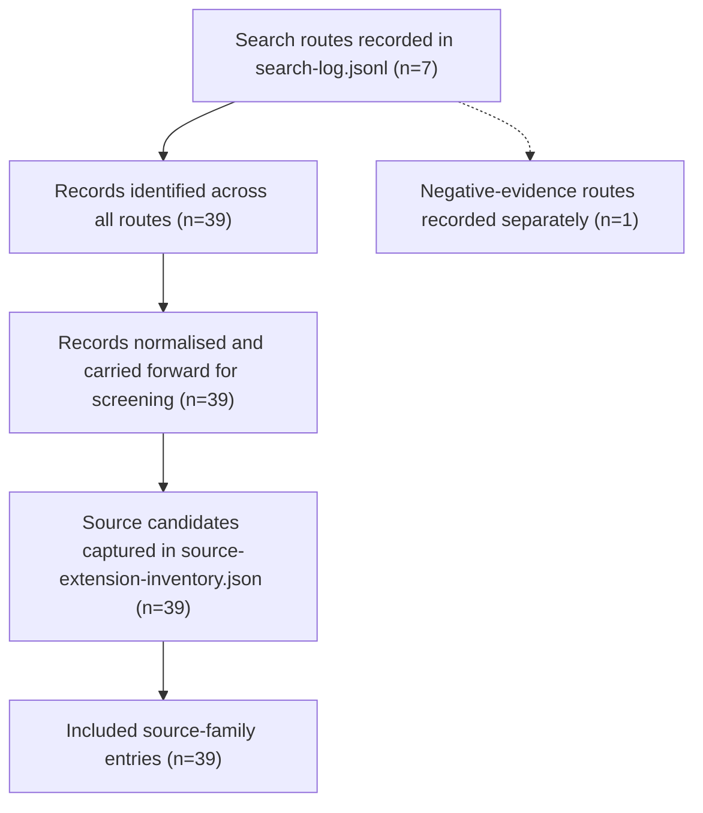

# PRISMA 2020 Source Discovery Flow

This figure adapts the PRISMA 2020 flow-diagram template for the UOGTO article-hardening evidence package. Counts reflect the current repository snapshot on 2026-06-25 and are derived from `docs/article-hardening/search-log.jsonl`.

Notes:
- The flow is PRISMA 2020-style, adapted for ontology source discovery rather than trial retrieval.
- The negative-evidence route is recorded as searched-and-not-found evidence, not as an exclusion claim.
- PRISMA 2020 checklist and flow-diagram resources are published by the PRISMA statement team.
