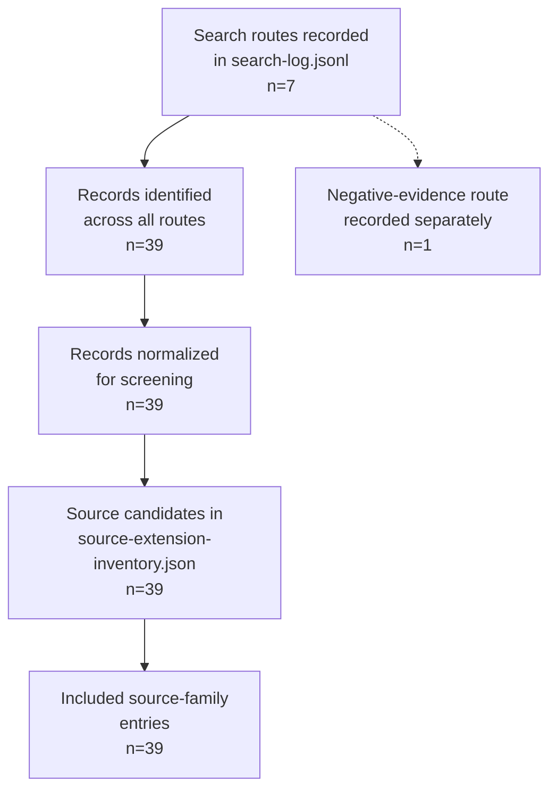

# PRISMA 2020-style source discovery flow

Search routes, identified records, normalization, inventory capture, inclusion, and negative-evidence recording for UOGTO source discovery.

```mermaid
flowchart TD
    N0["Search routes recorded<br/>in search-log.jsonl<br/>n=7"]
    N1["Records identified<br/>across all routes<br/>n=39"]
    N2["Records normalized<br/>for screening<br/>n=39"]
    N3["Source candidates in<br/>source-extension-inventory.json<br/>n=39"]
    N4["Included source-family<br/>entries<br/>n=39"]
    N5["Negative-evidence route<br/>recorded separately<br/>n=1"]
    N0 --> N1
    N1 --> N2
    N2 --> N3
    N3 --> N4
    N0 -.-> N5
```
