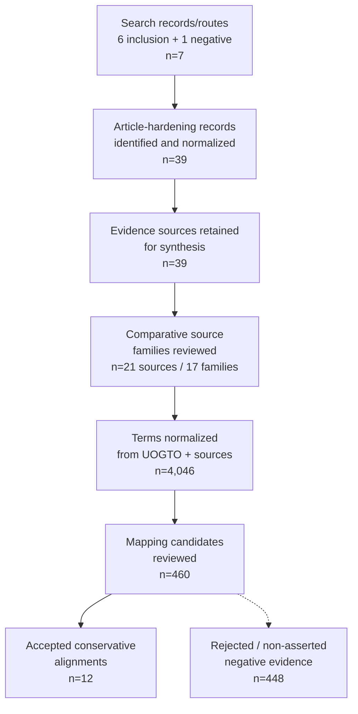

# PRISMA-style systematic search and ontology enrichment flow

Broad source discovery, source-family screening, feature extraction, candidate mapping review, and conservative alignment outcomes for UOGTO.

