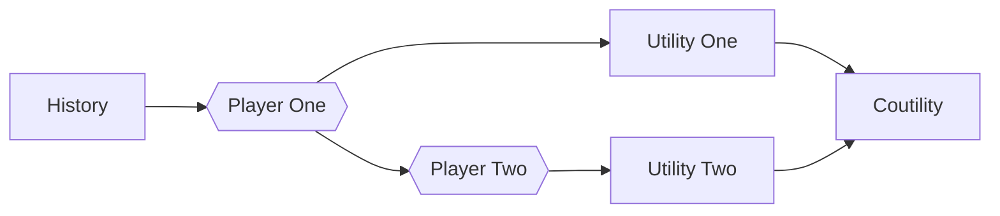
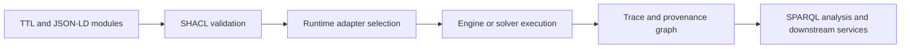

# ChatGPT Deep Research Output - Part 2

    # UOGTO Modular Ontology Extension for Machine-Readable Multi-Game Execution

## Executive summary

The strongest path from UOGTO v1.0 to a robust v2.0 is not to treat the fifteen missing areas as fifteen unrelated add-ons, but as a coordinated **ontology network**: a shared core for agents, actions, states, strategies, payoffs, information, norms, traces, and validation; then modular extensions for learning, mechanisms, causality, networks, population limits, evolutionary dynamics, institutions, deontics, collective choice, LLM agents, digital twins, categorical composition, Open Games interop, Petri/DEVS interop, and knowledge-graph execution. That modular approach is consistent with established ontology engineering advice to define scope, reuse what exists, enumerate terms, build the class hierarchy, define properties and constraints, and iterate; it is also aligned with ontology-network approaches such as NeOn for distributed, evolving modular ontologies. citeturn30search0turn30search4turn30search2

The core architectural recommendation is to make **RDF/OWL the semantic source of truth**, **JSON-LD the application-facing exchange format**, **SHACL the data-validation layer**, and **SPARQL the query/execution-binding layer**. W3C specifications make this stack unusually well suited to a Git-managed, machine-readable execution architecture, because RDF supplies the graph data model, JSON-LD supplies linked-data serialisation in JSON syntax, SHACL supplies graph validation, and SPARQL supplies standardised query semantics. citeturn21search2turn12view7turn12view5turn12view6

Across the fifteen areas, the most important design move is to distinguish four levels that were only partially separated in v1.0: **declarative model semantics**; **solver or runtime contracts**; **execution traces**; and **external bindings**. That separation is strongly suggested by the literature and tooling: OpenSpiel procedurally represents games and algorithms; PettingZoo standardises runtime environment APIs; DoWhy separates causal specification from inference tasks; DTDL and AAS separate twin metamodels from runtime instances; Catlab and open-games-hs separate abstract composition from executable artefacts; PNML separates Petri-net interchange from simulator execution; and Jena/RDF4J separate graph storage from validation and query services. citeturn12view0turn12view1turn26view8turn12view4turn14view2turn12view10turn13view5turn26view6turn22view4turn22view5

My recommended UOGTO v2.0 defaults are these. Model games as **typed executable artefacts** with explicit solver hooks. Prefer **probabilistic transition and payoff kernels** wherever the literature makes uncertainty first-class. Represent synchrony and asynchrony explicitly rather than forcing one universal step model. Place normative and institutional semantics in a layer that can govern any game, rather than embedding them only inside sociotechnical subclasses. Use categorical composition and Open Games as the **compositional meta-layer**, not as the only runtime. Use Petri/DEVS modules for interoperable execution semantics. Use knowledge-graph bindings for validation, trace storage, provenance, and cross-game querying. Those defaults are the most portable across the cited formal theories and the current implementation ecosystem. citeturn17search5turn28view4turn28view0turn28view6turn19search17turn2search0turn13view5turn26view6turn26view7turn22view4turn22view5

## Method and cross-cutting ontology design

### Ontology engineering method

For v2.0, I recommend an iterative process that combines the practical steps of *Ontology Development 101* with an ontology-network stance from NeOn. In concrete terms: define competency questions and execution queries; identify reusable source vocabularies and standards; enumerate terms per module; define classes and taxonomies; define object and data properties; encode constraints in OWL and SHACL; instantiate canonical examples; then stabilise module boundaries and integration contracts. Noy and McGuinness explicitly frame ontology development as defining data and structure for reuse by other programs, while NeOn is particularly apt for a modular, evolving ontology family with reuse and re-engineering across distributed teams. citeturn30search0turn30search2turn30search4

For UOGTO v2.0 specifically, the ontology should answer at least these competency-question families. Which agents, states, actions, and rules define a game? Which solver or runtime can execute it? Which traces, interventions, norms, ballots, messages, or sync events occurred? Which external representation or engine is bound to the game? Which validation rules must hold before execution? Those families are directly motivated by the cited runtime and standards stack: procedural games in OpenSpiel, multi-agent environment APIs in PettingZoo, graph validation in SHACL, SPARQL querying over RDF stores, DTDL twin models in JSON-LD, and AAS submodel ecosystems. citeturn12view0turn12view1turn12view5turn12view6turn12view4turn22view3

### Domain specification for the extension

The extended ontology should introduce three new abstract layers above the per-area modules. The first is **execution semantics**, for classes such as `ExecutionModel`, `Solver`, `RuntimeAdapter`, `ExecutionTrace`, `ValidationArtifact`, and `Binding`. The second is **external formalism interoperability**, for classes such as `CausalModel`, `TwinModel`, `PetriNetModel`, `DEVSModel`, `OpenGameProgram`, and `SPARQLBinding`. The third is **governance and collective organisation**, for classes such as `InstitutionalStatement`, `DeonticTheory`, `PreferenceProfile`, and `VotingRule`. This separation is not arbitrary; it follows the recurring distinction between model, formalism, and runtime across the source ecosystem. citeturn26view8turn12view4turn14view1turn13view5turn26view6turn22view4turn22view5

A practical consequence is that UOGTO v2.0 should stop treating “game” as only a mathematical object. It should instead distinguish `GameSpecification`, `GameInstance`, `ExecutionRun`, and `ExecutionTrace`. That is exactly the distinction needed to represent, for example, a Markov game specification, a particular PettingZoo environment instance, a training run in RLlib, and the trajectory trace; or a DTDL twin model, a twin graph instance, a sync cycle, and the resulting telemetry trace. The literature and official docs consistently make those separations even when they do not name them in ontology terms. citeturn12view1turn0search8turn26view2turn22view2

### Updated class tree

```mermaid
classDiagram
    gt:Game <|-- gt:StochasticGame
    gt:StochasticGame <|-- marl:MarkovGame
    gt:MechanismDesignGame <|-- auc:AuctionGame
    gt:Game <|-- causal:CausalGame
    gt:Game <|-- net:NetworkGame
    gt:Game <|-- mfg:MeanFieldGame
    gt:EvolutionaryGame <|-- evo:PopulationGame
    gt:Institution <|-- inst:InstitutionalOrder
    gt:Norm <|-- deon:ConditionalNorm
    gt:MultiAgentGame <|-- llm:LLMAgentGame
    gt:Game <|-- twin:TwinSynchronizedGame
    gt:Game <|-- comp:CompositionalGame
    comp:CompositionalGame <|-- og:OpenGameProgram
    gt:SimulationModel <|-- sim:PetriNetModel
    gt:SimulationModel <|-- sim:DEVSModel
    gt:ExecutionBinding <|-- kg:SPARQLBinding
    gt:ExecutionBinding <|-- twin:DTDLBinding
    gt:ExecutionBinding <|-- twin:AASBinding
```

The key update is that several v1.0 classes that were previously peers should now be re-factored into a stricter hierarchy. In particular, `OpenGameProgram`, `PetriNetModel`, `DEVSModel`, and `SPARQLBinding` are not themselves ordinary games in the same sense as a normal-form or stochastic game; they are **formal or executable representations of games**. Likewise, `InstitutionalOrder`, `ConditionalNorm`, and `PreferenceProfile` are best treated as governing or aggregative structures that can attach to many game families. This is the cleanest way to reconcile game theory, MAS, digital twins, simulation, and linked-data execution without making the core ontology incoherent. citeturn7search4turn19search17turn31view0turn13view5turn26view6turn22view5

### Shared object properties and constraints

At the core layer, I recommend adding the following reusable properties: `gt:hasExecutionModel`, `gt:usesSolver`, `gt:producesTrace`, `gt:validatedBy`, `gt:bindsToExternalFormalism`, `gt:hasSemanticReference`, `gt:hasRuntimeIdentifier`, `gt:hasObservation`, `gt:hasIntervention`, `gt:governedByInstitution`, `gt:aggregatesPreferencesFrom`, and `gt:storedInGraph`. These properties give all fifteen modules an interoperable backbone. They are especially important because SHACL, RDF stores, DTDL, and AAS all assume that semantic identity, validation, and exchange are first-class rather than afterthoughts. citeturn12view5turn12view4turn14view3turn22view3turn22view4turn22view5

A compact shared OWL pattern for executable games is as follows.

```manchester
Class: gt:ExecutableGame
  EquivalentTo:
    gt:Game
    and (gt:hasExecutionModel some gt:ExecutionModel)
    and (gt:validatedBy some gt:ValidationArtifact)

Class: gt:ExecutionRun
  SubClassOf:
    (gt:executesGame exactly 1 gt:ExecutableGame),
    (gt:producesTrace some gt:ExecutionTrace)

Class: gt:ExecutionBinding
  SubClassOf:
    (gt:bindsSpecification exactly 1 gt:GameSpecification)
```

That pattern is deliberately sparse. It imposes only the constraints that are common across essentially all runtime families in scope, while leaving each module to add its own stronger semantics. It is the correct level of abstraction for a multi-game ontology rather than a single-domain DSL. citeturn30search0turn12view5turn12view6

## Strategic learning and market design modules

### Multi-Agent Reinforcement Learning

The natural formal anchor for the MARL module is the **Markov game** tradition, beginning with Littman’s framing of Markov games for multi-agent reinforcement learning and continuing into current environment standards and algorithm libraries. OpenSpiel explicitly supports multi-player, sequential and simultaneous, perfect and imperfect information games, representing them procedurally as extensive-form games with natural extensions; PettingZoo standardises MARL environments with AEC and Parallel APIs; and PettingZoo’s tutorials explicitly integrate with RLlib. That combination implies that the ontology should cleanly separate **game specification**, **environment API**, **episode trace**, **trainer**, and **policy artefacts**. citeturn0search0turn12view0turn12view1turn5search3turn0search8

For UOGTO, add `marl:MarkovGame`, `marl:ObservationSpace`, `marl:Observation`, `marl:Policy`, `marl:JointPolicyProfile`, `marl:RewardSignal`, `marl:Episode`, `marl:TimeStep`, `marl:ReplayBuffer`, `marl:Trainer`, and `marl:EnvironmentAdapter`. The essential properties are `marl:hasObservationSpace`, `marl:observes`, `marl:hasReward`, `marl:updatesPolicy`, `marl:storesTransition`, `marl:usesEnvironmentAPI`, and datatypes such as `marl:discountFactor` and `marl:learningRate`. The key execution semantics are: an `Episode` is an ordered trace of `TimeStep`s; each `TimeStep` links observations, actions, rewards, and successor state; and a `Trainer` consumes traces to update policies or value functions. citeturn12view0turn12view1turn0search8

`Manchester:` `marl:MarkovGame SubClassOf gt:StochasticGame and (marl:hasObservationSpace some marl:ObservationSpace) and (gt:hasPlayer min 2 gt:Player)`.

```ttl
@prefix gt: <https://w3id.org/uogto/core#> .
@prefix marl: <https://w3id.org/uogto/marl#> .
@prefix rdfs: <http://www.w3.org/2000/01/rdf-schema#> .

marl:MarkovGame rdfs:subClassOf gt:StochasticGame .
marl:Policy rdfs:subClassOf gt:Strategy .
marl:Observation a rdfs:Class .
marl:Episode a rdfs:Class .
marl:hasObservation a gt:ObjectProperty .
marl:updatesPolicy a gt:ObjectProperty .

marl:GridworldEpisode a marl:Episode ;
  gt:hasPlayer gt:AgentA, gt:AgentB ;
  marl:hasObservation marl:ObsA0, marl:ObsB0 ;
  gt:resultsInState gt:GridState_0_0 .
```

```json
{
  "@context": {
    "gt": "https://w3id.org/uogto/core#",
    "marl": "https://w3id.org/uogto/marl#",
    "rdfs": "http://www.w3.org/2000/01/rdf-schema#"
  },
  "@graph": [
    {"@id": "marl:MarkovGame", "@type": "rdfs:Class", "rdfs:subClassOf": {"@id": "gt:StochasticGame"}},
    {"@id": "marl:Policy", "@type": "rdfs:Class", "rdfs:subClassOf": {"@id": "gt:Strategy"}},
    {"@id": "marl:GridworldEpisode", "@type": "marl:Episode", "gt:hasPlayer": [{"@id":"gt:AgentA"},{"@id":"gt:AgentB"}]}
  ]
}
```

Implementation mapping should target OpenSpiel for game-theoretic benchmarks, PettingZoo for environment standardisation, and RLlib or equivalent trainers through adapters that bind ontology instances to environment constructors and training configs. In data-oriented software terms, `Observation`, `Action`, `RewardSignal`, and `State` should be immutable event records in traces; `Policy` and `ValueFunction` should be versioned artefacts; and `Trainer` should be an execution service rather than part of the game object itself. citeturn12view0turn12view1turn0search8

### Mechanism Design and Auctions

Mechanism design in v2.0 should be represented as a **game family with message semantics**, not merely as a subtype of bargaining or auction. Vickrey’s sealed-tender work and Myerson’s optimal auction design make clear that messages, allocation rules, payment rules, and information assumptions are ontologically central. OpenSpiel’s current catalogue includes first-price sealed-bid auctions, which is useful as an execution benchmark, but the ontology must be more general than any one simulator. citeturn16search0turn0search1turn16search14turn26view0

Add `auc:Mechanism`, `auc:MessageSpace`, `auc:Report`, `auc:Type`, `auc:AllocationRule`, `auc:PaymentRule`, `auc:AuctionGame`, `auc:SealedBidAuction`, `auc:ReservePrice`, `auc:Lot`, `auc:Auctioneer`, and `auc:ImplementationConcept`. The fundamental properties are `auc:hasMessageSpace`, `auc:submitsReport`, `auc:hasAllocationRule`, `auc:hasPaymentRule`, `auc:allocatesLotTo`, `auc:chargesPayment`, `auc:hasReservePrice`, and `auc:isDirectMechanism`. This makes the ontology expressive enough for first-price, second-price, all-pay, discriminatory, and combinatorial extensions. citeturn16search0turn0search1turn16search22

`Manchester:` `auc:SingleUnitSealedBidAuction SubClassOf auc:SealedBidAuction and (auc:hasLot exactly 1 auc:Lot) and (auc:allocatesLotTo max 1 gt:Player)`.

```ttl
@prefix gt: <https://w3id.org/uogto/core#> .
@prefix auc: <https://w3id.org/uogto/auction#> .
@prefix rdfs: <http://www.w3.org/2000/01/rdf-schema#> .

auc:AuctionGame rdfs:subClassOf gt:MechanismDesignGame .
auc:SealedBidAuction rdfs:subClassOf auc:AuctionGame .
auc:Bid a rdfs:Class .
auc:hasPaymentRule a gt:ObjectProperty .
auc:allocatesLotTo a gt:ObjectProperty .

auc:Auction001 a auc:SealedBidAuction ;
  auc:hasPaymentRule auc:FirstPriceRule ;
  auc:allocatesLotTo gt:BidderA .
```

```json
{
  "@context": {
    "gt": "https://w3id.org/uogto/core#",
    "auc": "https://w3id.org/uogto/auction#",
    "rdfs": "http://www.w3.org/2000/01/rdf-schema#"
  },
  "@graph": [
    {"@id":"auc:AuctionGame","@type":"rdfs:Class","rdfs:subClassOf":{"@id":"gt:MechanismDesignGame"}},
    {"@id":"auc:SealedBidAuction","@type":"rdfs:Class","rdfs:subClassOf":{"@id":"auc:AuctionGame"}},
    {"@id":"auc:Auction001","@type":"auc:SealedBidAuction","auc:hasPaymentRule":{"@id":"auc:FirstPriceRule"}}
  ]
}
```

For execution, I recommend a runtime split into `MessageCollector`, `Allocator`, `Payer`, and optional `OutcomeAuditor`. That maps cleanly to educational and benchmark engines such as OpenSpiel for simple auctions, and to production mechanism services where message collection, allocation, and settlement are operationally distinct. The ontology should therefore encode mechanism semantics declaratively and let engine-specific adapters realise them. citeturn26view0turn16search14

### Causal Game Theory

The causal game module should be grounded in **structural causal models**, enriched with multi-agent decision variables and strategic semantics. Pearl’s SCM work defines the structural basis, Koller and Milch’s multi-agent influence diagrams supply a multi-agent graphical decision representation, and Hammond et al.’s structural causal games explicitly extend game-theoretic reasoning with predictions, interventions, and counterfactuals. DoWhy and DoWhy-GCM then provide a practical execution target for intervention and counterfactual tasks. citeturn17search0turn17search6turn17search1turn17search5turn26view8turn27view2

Add `causal:CausalGame`, `causal:StructuralCausalModel`, `causal:CausalVariable`, `causal:EndogenousVariable`, `causal:ExogenousVariable`, `causal:Intervention`, `causal:CounterfactualQuery`, `causal:CausalMechanism`, `causal:StrategicParent`, and `causal:InterventionalOutcome`. Key properties are `causal:hasCausalModel`, `causal:hasVariable`, `causal:hasParentVariable`, `causal:performsIntervention`, `causal:asksCounterfactual`, `causal:estimatesEffectOn`, and `causal:usesMechanism`. Execution semantics should distinguish ordinary conditional predictions from `do`-interventions and counterfactuals, because stronger assumptions are needed for counterfactual estimation, especially invertible mechanisms in practice. citeturn17search12turn17search5turn27view0turn27view1

`Manchester:` `causal:CausalGame SubClassOf gt:Game and (causal:hasCausalModel exactly 1 causal:StructuralCausalModel)`.

```ttl
@prefix gt: <https://w3id.org/uogto/core#> .
@prefix causal: <https://w3id.org/uogto/causal#> .
@prefix rdfs: <http://www.w3.org/2000/01/rdf-schema#> .

causal:CausalGame rdfs:subClassOf gt:Game .
causal:StructuralCausalModel a rdfs:Class .
causal:Intervention a rdfs:Class .
causal:hasCausalModel a gt:ObjectProperty .
causal:performsIntervention a gt:ObjectProperty .

causal:Game001 a causal:CausalGame ;
  causal:hasCausalModel causal:SCM001 ;
  causal:performsIntervention causal:DoAd1 .
```

```json
{
  "@context": {
    "gt": "https://w3id.org/uogto/core#",
    "causal": "https://w3id.org/uogto/causal#",
    "rdfs": "http://www.w3.org/2000/01/rdf-schema#"
  },
  "@graph": [
    {"@id":"causal:CausalGame","@type":"rdfs:Class","rdfs:subClassOf":{"@id":"gt:Game"}},
    {"@id":"causal:Game001","@type":"causal:CausalGame","causal:hasCausalModel":{"@id":"causal:SCM001"}}
  ]
}
```

The execution mapping should treat causal queries as specialised solver contracts. `PredictionTask`, `InterventionTask`, and `CounterfactualTask` should all be subclasses of a generic `InferenceTask`, because they consume the same causal model but differ in required assumptions and operators. That structure maps directly onto DoWhy/GCM tasks while staying neutral at the ontology level. citeturn27view2turn27view0

### Network Games

Network games require the ontology to treat social or technological structure as a first-class game object rather than a side annotation. Jackson and Zenou’s survey makes the structural dependence explicit, while Bramoullé, Kranton, and D’Amours show that a broad class of equilibria depend on spectral properties such as the lowest eigenvalue. NetworkX and Mesa provide natural execution bindings for graphs and agent-based network simulations. citeturn28view3turn28view4turn6search1turn22view1

Add `net:NetworkGame`, `net:NetworkTopology`, `net:NodePlayer`, `net:EdgeRelation`, `net:LocalExternality`, `net:AdjacencyStructure`, `net:NetworkEquilibrium`, and `net:CentralityMeasure`. Key properties are `net:hasTopology`, `net:adjacentTo`, `net:influences`, `net:hasExternalityType`, `net:hasCentralityScore`, and `net:hasSpectralStatistic`. Execution semantics should permit static fixed networks, endogenous network formation, and multiplex extension points, but the recommended default for v2.0 is a fixed topology attached to a game instance. citeturn28view3turn28view4turn9search10

`Manchester:` `net:NetworkGame SubClassOf gt:Game and (net:hasTopology exactly 1 net:NetworkTopology)`.

```ttl
@prefix gt: <https://w3id.org/uogto/core#> .
@prefix net: <https://w3id.org/uogto/network#> .
@prefix rdfs: <http://www.w3.org/2000/01/rdf-schema#> .

net:NetworkGame rdfs:subClassOf gt:Game .
net:NetworkTopology a rdfs:Class .
net:adjacentTo a gt:ObjectProperty .
net:hasTopology a gt:ObjectProperty .

net:CoordinationGame001 a net:NetworkGame ;
  net:hasTopology net:LineABC .
net:LineABC a net:NetworkTopology .
gt:PlayerA net:adjacentTo gt:PlayerB .
gt:PlayerB net:adjacentTo gt:PlayerC .
```

```json
{
  "@context": {
    "gt": "https://w3id.org/uogto/core#",
    "net": "https://w3id.org/uogto/network#",
    "rdfs": "http://www.w3.org/2000/01/rdf-schema#"
  },
  "@graph": [
    {"@id":"net:NetworkGame","@type":"rdfs:Class","rdfs:subClassOf":{"@id":"gt:Game"}},
    {"@id":"net:CoordinationGame001","@type":"net:NetworkGame","net:hasTopology":{"@id":"net:LineABC"}}
  ]
}
```

In software architecture, `NetworkTopology` should be a separately serialisable artefact that can be loaded into NetworkX for graph calculations or into Mesa for ABM-style execution. That makes spectral or centrality analyses reusable across equilibrium solvers, diffusion simulators, and policy experiments. citeturn18search10turn18search15

### Mean-Field Games

Mean-field games are limiting models for large populations where each agent best-responds to aggregate population statistics rather than full microstate detail. The SIAM overview traces the field to Lasry and Lions and the parallel Nash-certainty-equivalence work of Huang, Caines, and Malhamé; MFGLib formalises the software need for a standardised MFG environment/solver split. That strongly suggests a representative-agent ontology with explicit population distribution objects. citeturn28view0turn28view2turn12view8

Add `mfg:MeanFieldGame`, `mfg:RepresentativeAgent`, `mfg:PopulationDistribution`, `mfg:AggregateState`, `mfg:DistributionFlow`, `mfg:MeanFieldOperator`, and `mfg:MeanFieldEquilibrium`. The core properties are `mfg:hasRepresentativeAgent`, `mfg:hasPopulationDistribution`, `mfg:bestRespondsToDistribution`, `mfg:inducesDistributionFlow`, and datatypes such as `mfg:populationMass`. The execution semantics are two-sided: solve the representative-agent control problem and the population consistency condition together. citeturn28view0turn28view1turn28view2

`Manchester:` `mfg:MeanFieldGame SubClassOf gt:Game and (mfg:hasRepresentativeAgent exactly 1 mfg:RepresentativeAgent) and (mfg:hasPopulationDistribution some mfg:PopulationDistribution)`.

```ttl
@prefix gt: <https://w3id.org/uogto/core#> .
@prefix mfg: <https://w3id.org/uogto/mfg#> .
@prefix rdfs: <http://www.w3.org/2000/01/rdf-schema#> .

mfg:MeanFieldGame rdfs:subClassOf gt:Game .
mfg:PopulationDistribution a rdfs:Class .
mfg:hasPopulationDistribution a gt:ObjectProperty .

mfg:PopulationGame001 a mfg:MeanFieldGame ;
  mfg:hasPopulationDistribution mfg:Dist_t0 .
mfg:Dist_t0 a mfg:PopulationDistribution ;
  mfg:populationMass "0.7"^^<http://www.w3.org/2001/XMLSchema#decimal> .
```

```json
{
  "@context": {
    "gt": "https://w3id.org/uogto/core#",
    "mfg": "https://w3id.org/uogto/mfg#",
    "rdfs": "http://www.w3.org/2000/01/rdf-schema#"
  },
  "@graph": [
    {"@id":"mfg:MeanFieldGame","@type":"rdfs:Class","rdfs:subClassOf":{"@id":"gt:Game"}},
    {"@id":"mfg:PopulationGame001","@type":"mfg:MeanFieldGame","mfg:hasPopulationDistribution":{"@id":"mfg:Dist_t0"}}
  ]
}
```

For execution, MFGLib is the clearest current adapter target. In a data-oriented design, the ontology should serialise environment definitions, initial distributions, solver configuration, and convergence diagnostics separately, rather than burying them in a monolithic “game” object. citeturn12view8turn9search8

## Social, normative, and collective choice modules

### Evolutionary Dynamics

Evolutionary game theory adds population-level dynamics and stability concepts that are not reducible to ordinary equilibrium classes. The canonical starting point is Maynard Smith and Price’s ESS, with replicator dynamics later formalised by Taylor and Jonker; the Stanford Encyclopedia emphasises that ESS and replicator stability are related but not identical, and Nashpy implements both replicator and Moran-process style execution hooks. citeturn31view5turn29search5turn29search2turn26view9turn29search3

Add `evo:PopulationGame`, `evo:StrategyFrequencyState`, `evo:FitnessFunction`, `evo:ReplicatorDynamic`, `evo:MoranProcess`, `evo:MutationProcess`, `evo:ESS`, and `evo:FixationEvent`. The essential properties are `evo:hasPopulationState`, `evo:hasFrequency`, `evo:hasFitness`, `evo:evolvesBy`, `evo:hasMutationRate`, and `evo:fixatesOn`. Execution semantics should support both continuous-time dynamics such as replicator flow and discrete stochastic processes such as Moran birth-death dynamics. citeturn29search2turn26view9turn29search7

`Manchester:` `evo:StrategyFrequencyState SubClassOf gt:State and (evo:hasFrequency some xsd:decimal)`.

```ttl
@prefix gt: <https://w3id.org/uogto/core#> .
@prefix evo: <https://w3id.org/uogto/evo#> .
@prefix rdfs: <http://www.w3.org/2000/01/rdf-schema#> .

evo:PopulationGame rdfs:subClassOf gt:EvolutionaryGame .
evo:ReplicatorDynamic a rdfs:Class .
evo:ESS a rdfs:Class .
evo:evolvesBy a gt:ObjectProperty .

evo:HawkDoveGame a evo:PopulationGame ;
  evo:evolvesBy evo:ReplicatorFlow001 .
evo:State_t0 a evo:StrategyFrequencyState ;
  evo:hasFrequency "0.40"^^<http://www.w3.org/2001/XMLSchema#decimal> .
```

```json
{
  "@context": {
    "gt": "https://w3id.org/uogto/core#",
    "evo": "https://w3id.org/uogto/evo#",
    "rdfs": "http://www.w3.org/2000/01/rdf-schema#"
  },
  "@graph": [
    {"@id":"evo:PopulationGame","@type":"rdfs:Class","rdfs:subClassOf":{"@id":"gt:EvolutionaryGame"}},
    {"@id":"evo:HawkDoveGame","@type":"evo:PopulationGame","evo:evolvesBy":{"@id":"evo:ReplicatorFlow001"}}
  ]
}
```

The software mapping is straightforward: Nashpy for matrix-game dynamics and Mesa for richer spatial or heterogeneous ABM variants. The ontology should therefore preserve both compact matrix-game execution and explicit-agent simulation as valid implementations of the same abstract evolutionary module. citeturn26view9turn22view1

### Institutional Economics

Institutional-economics content belongs in UOGTO v2.0 because institutions change incentives, feasible actions, and sanctions without being reducible to either pure deontics or generic norms. Ostrom’s IAD framework treats institutions as part of the structure of action situations, and the Institutional Grammar tradition provides a disciplined syntax for rules, norms, and strategies, especially through ADICO and ABDICO decompositions. Normative MAS literature provides the computational bridge by coupling norms, violations, and decision-theoretic behaviour. citeturn28view6turn28view7turn28view9turn28view8

Add `inst:InstitutionalOrder`, `inst:ActionArena`, `inst:Position`, `inst:RuleInUse`, `inst:InstitutionalStatement`, `inst:RegulativeStatement`, `inst:ConstitutiveStatement`, `inst:SharedStrategy`, `inst:SanctioningRule`, and ADICO/ABDICO role fillers such as `inst:AttributeRole`, `inst:AimRole`, `inst:ConditionRole`, `inst:OrElseRole`, `inst:ObjectRole`. Key properties are `inst:governsArena`, `inst:hasInstitutionalStatement`, `inst:hasAttribute`, `inst:hasAim`, `inst:hasCondition`, `inst:hasObject`, and `inst:hasOrElse`. This lets the ontology represent not only abstract institutions but formally decomposed institutional text. citeturn28view7turn28view9turn19search15

`Manchester:` `inst:InstitutionalStatement SubClassOf (inst:hasAttribute exactly 1 gt:Agent) and (inst:hasAim exactly 1 gt:Action)`.

```ttl
@prefix gt: <https://w3id.org/uogto/core#> .
@prefix inst: <https://w3id.org/uogto/institution#> .
@prefix rdfs: <http://www.w3.org/2000/01/rdf-schema#> .

inst:InstitutionalOrder rdfs:subClassOf gt:Institution .
inst:InstitutionalStatement a rdfs:Class .
inst:hasOrElse a gt:ObjectProperty .

inst:QuotaRule a inst:InstitutionalStatement ;
  inst:hasAttribute gt:Fisher ;
  inst:hasAim gt:ExceedQuota ;
  inst:hasOrElse gt:FineSanction .
```

```json
{
  "@context": {
    "gt": "https://w3id.org/uogto/core#",
    "inst": "https://w3id.org/uogto/institution#",
    "rdfs": "http://www.w3.org/2000/01/rdf-schema#"
  },
  "@graph": [
    {"@id":"inst:InstitutionalOrder","@type":"rdfs:Class","rdfs:subClassOf":{"@id":"gt:Institution"}},
    {"@id":"inst:QuotaRule","@type":"inst:InstitutionalStatement","inst:hasOrElse":{"@id":"gt:FineSanction"}}
  ]
}
```

The recommended execution mapping is to compile institutional statements into an event-condition-action or rule-engine layer that governs base games. That is more general than hard-coding one institutional simulator, and it matches the MAS literature’s treatment of institutions as a layer constraining agent interaction. citeturn7search0turn7search4

### Deontic Logic

Deontic logic should be separated from institutions because institutional statements often embed richer actor and sanction structure, whereas deontic logic focuses on formal normative consequence, permission, prohibition, obligation, and contrary-to-duty reasoning. Standard Deontic Logic remains the canonical baseline, while input/output logic is often a better computational fit for conditional norms, and LogiKEy provides modern theorem-proving support for deontic and normative reasoning. citeturn19search17turn19search6turn7search6turn7search10

Add `deon:DeonticTheory`, `deon:DeonticOperator`, `deon:Obligation`, `deon:Permission`, `deon:Prohibition`, `deon:ConditionalNorm`, `deon:ContraryToDutyNorm`, `deon:Violation`, and `deon:ReparationChain`. Essential properties are `deon:hasAntecedent`, `deon:hasConsequent`, `deon:violatedBy`, `deon:repairedBy`, and `deon:holdsInContext`. Execution semantics should allow derivation of normative conclusions from facts plus norms, with explicit support for violations and reparations rather than only ideal-duty worlds. citeturn19search17turn19search6turn7search10

`Manchester:` `deon:ConditionalNorm SubClassOf (deon:hasAntecedent some owl:Thing) and (deon:hasConsequent some deon:DeonticOperator)`.

```ttl
@prefix deon: <https://w3id.org/uogto/deontic#> .
@prefix rdfs: <http://www.w3.org/2000/01/rdf-schema#> .

deon:Obligation rdfs:subClassOf deon:DeonticOperator .
deon:Permission rdfs:subClassOf deon:DeonticOperator .
deon:Prohibition rdfs:subClassOf deon:DeonticOperator .
deon:hasAntecedent a <http://www.w3.org/2002/07/owl#ObjectProperty> .

deon:MonthEndReportNorm a deon:ConditionalNorm ;
  deon:hasAntecedent deon:AtMonthEnd ;
  deon:hasConsequent deon:ObligationToFileReport .
```

```json
{
  "@context": {
    "deon": "https://w3id.org/uogto/deontic#",
    "rdfs": "http://www.w3.org/2000/01/rdf-schema#"
  },
  "@graph": [
    {"@id":"deon:Obligation","@type":"rdfs:Class","rdfs:subClassOf":{"@id":"deon:DeonticOperator"}},
    {"@id":"deon:MonthEndReportNorm","@type":"deon:ConditionalNorm","deon:hasConsequent":{"@id":"deon:ObligationToFileReport"}}
  ]
}
```

The direct software mapping is to theorem provers and deontic reasoners such as LogiKEy, with optional rule-engine embeddings for lightweight operational use. For UOGTO, the key point is that the ontology should serialise the normative theory and facts cleanly enough that multiple reasoners can be swapped in. citeturn7search6turn7search10

### Computational Social Choice

The social-choice module should model **preference aggregation as an executable semantic component**. The field studies aggregation of individual preferences into collective choice; the computational literature foregrounds winner determination, manipulation, complexity, fair allocation, and coalition formation; and current implementation ecosystems revolve around preference datasets and voting libraries such as PrefLib, preflib-tools, and `pref_voting`. Arrow, Gibbard, and Satterthwaite remain the essential impossibility landmarks in the background. citeturn31view1turn31view0turn13view3turn22view6turn31view3turn31view4

Add `soc:PreferenceProfile`, `soc:Ballot`, `soc:RankedBallot`, `soc:ApprovalBallot`, `soc:CardinalBallot`, `soc:VotingRule`, `soc:SocialChoiceFunction`, `soc:SocialWelfareFunction`, `soc:WinnerSet`, `soc:TieBreakRule`, and `soc:ManipulationScenario`. Key properties are `soc:containsBallot`, `soc:ranksAlternative`, `soc:approvesAlternative`, `soc:elects`, `soc:computesWinnerSet`, and `soc:usesTieBreakRule`. This covers both symbolic and algorithmic execution. citeturn31view0turn22view6turn13view3

`Manchester:` `soc:DeterministicSingleWinnerRule SubClassOf (soc:computesWinnerSet max 1 soc:Alternative)`.

```ttl
@prefix soc: <https://w3id.org/uogto/socialchoice#> .
@prefix rdfs: <http://www.w3.org/2000/01/rdf-schema#> .

soc:PreferenceProfile a rdfs:Class .
soc:VotingRule a rdfs:Class .
soc:containsBallot a <http://www.w3.org/2002/07/owl#ObjectProperty> .
soc:elects a <http://www.w3.org/2002/07/owl#ObjectProperty> .

soc:Profile001 a soc:PreferenceProfile ;
  soc:containsBallot soc:B1, soc:B2, soc:B3 .
soc:PluralityRule a soc:VotingRule .
soc:PluralityOutcome soc:elects soc:AltA .
```

```json
{
  "@context": {
    "soc": "https://w3id.org/uogto/socialchoice#",
    "rdfs": "http://www.w3.org/2000/01/rdf-schema#"
  },
  "@graph": [
    {"@id":"soc:PreferenceProfile","@type":"rdfs:Class"},
    {"@id":"soc:Profile001","@type":"soc:PreferenceProfile","soc:containsBallot":[{"@id":"soc:B1"},{"@id":"soc:B2"},{"@id":"soc:B3"}]}
  ]
}
```

Execution mappings should separate `ProfileStore` from `Aggregator`. PrefLib and preflib-tools are excellent dataset and interchange targets, while `pref_voting` is a strong execution target for rule evaluation and axiom checks. That separation keeps empirical preference corpora independent from winner-determination services. citeturn13view3turn13view4turn22view6turn22view7

### LLM-Agent Interaction Games

LLM-agent interaction is now mature enough to deserve its own ontology module, but it should be modelled as a subclass of communication and multi-agent games rather than as “just software engineering”. CAMEL introduced one of the seminal role-playing, multi-agent LLM frameworks; AutoGen formalised event-driven multi-agent applications; OpenAI’s Agents SDK distinguishes manager-style orchestration from handoffs; LangGraph focuses on durable execution and stateful orchestration; and Microsoft’s Agent Framework now positions itself as a graph-based successor that combines AutoGen-style abstractions with enterprise state and workflow control. citeturn5search1turn12view2turn12view3turn27view3turn13view0turn13view1

Add `llm:LLMAgentGame`, `llm:LanguageModelAgent`, `llm:PromptMessage`, `llm:ConversationTurn`, `llm:ToolCallAction`, `llm:Handoff`, `llm:ManagerAgent`, `llm:SpecialistAgent`, `llm:ContextWindowState`, `llm:ApprovalGate`, and `llm:TraceSpan`. The decisive properties are `llm:sendsMessage`, `llm:receivesMessage`, `llm:callsTool`, `llm:handsOffTo`, `llm:keepsAnswerOwnership`, and `llm:usesModelIdentifier`. Execution semantics must explicitly encode ownership of the final answer, because modern orchestration frameworks distinguish delegation from specialist-as-tool patterns. citeturn27view3turn13view0turn13view1

`Manchester:` `llm:ConversationTurn SubClassOf (llm:hasSender exactly 1 llm:LanguageModelAgent) and (llm:hasMessage exactly 1 llm:PromptMessage)`.

```ttl
@prefix llm: <https://w3id.org/uogto/llm#> .
@prefix rdfs: <http://www.w3.org/2000/01/rdf-schema#> .

llm:LLMAgentGame a rdfs:Class .
llm:LanguageModelAgent a rdfs:Class .
llm:handsOffTo a <http://www.w3.org/2002/07/owl#ObjectProperty> .
llm:callsTool a <http://www.w3.org/2002/07/owl#ObjectProperty> .

llm:TriageGame a llm:LLMAgentGame .
llm:TriageAgent a llm:LanguageModelAgent ;
  llm:handsOffTo llm:SummariserAgent .
```

```json
{
  "@context": {
    "llm": "https://w3id.org/uogto/llm#",
    "rdfs": "http://www.w3.org/2000/01/rdf-schema#"
  },
  "@graph": [
    {"@id":"llm:LLMAgentGame","@type":"rdfs:Class"},
    {"@id":"llm:TriageAgent","@type":"llm:LanguageModelAgent","llm:handsOffTo":{"@id":"llm:SummariserAgent"}}
  ]
}
```

In software architecture, the ontology should represent prompt exchanges, tool invocations, handoffs, approvals, and traces as first-class events. That makes it possible to analyse LLM-agent systems with the same strategic and trace-query machinery used elsewhere in UOGTO. citeturn12view3turn27view3turn13view0

## Compositional, twin, and execution interoperability modules

### Digital Twin Execution Semantics

Digital twins are indispensable to a machine-readable multi-game framework whenever games are coupled to live systems, cyber-physical processes, or decision-support loops. The Digital Twin Consortium defines a digital twin as a data-driven virtual representation of real entities and processes with synchronised interaction at a specified frequency and fidelity. DTDL models digital twins in JSON-LD using metamodel classes such as `Interface`, `Property`, `Relationship`, `Component`, `Telemetry`, and `Command`, while AAS models a digital twin around an asset, submodels, and semantic references. citeturn22view2turn12view4turn26view2turn14view2turn14view1turn22view3

Add `twin:TwinSynchronizedGame`, `twin:DigitalTwin`, `twin:PhysicalAsset`, `twin:TwinState`, `twin:SynchronizationEvent`, `twin:TelemetryStream`, `twin:TwinInterface`, `twin:DTDLBinding`, `twin:AASBinding`, `twin:SubmodelProjection`, and `twin:SemanticReference`. The key properties are `twin:representsAsset`, `twin:syncsPhysical`, `twin:syncsDigital`, `twin:emitsTelemetry`, `twin:hasTwinInterface`, `twin:hasSubmodelProjection`, and `gt:hasSemanticReference`. The execution semantics should make sync cycles explicit, rather than treating twin state as magically current. citeturn22view2turn12view4turn14view2turn22view3

`Manchester:` `twin:SynchronizationEvent SubClassOf (twin:syncsPhysical exactly 1 twin:PhysicalAsset) and (twin:syncsDigital exactly 1 twin:TwinState)`.

```ttl
@prefix twin: <https://w3id.org/uogto/twin#> .
@prefix gt: <https://w3id.org/uogto/core#> .
@prefix rdfs: <http://www.w3.org/2000/01/rdf-schema#> .

twin:TwinSynchronizedGame rdfs:subClassOf gt:Game .
twin:DigitalTwin a rdfs:Class .
twin:SynchronizationEvent a rdfs:Class .
twin:representsAsset a gt:ObjectProperty .

twin:MotorTwin a twin:DigitalTwin ;
  twin:representsAsset twin:MotorA .
twin:Sync001 a twin:SynchronizationEvent ;
  twin:syncsPhysical twin:MotorA ;
  twin:syncsDigital twin:MotorState_t1 .
```

```json
{
  "@context": {
    "gt": "https://w3id.org/uogto/core#",
    "twin": "https://w3id.org/uogto/twin#",
    "rdfs": "http://www.w3.org/2000/01/rdf-schema#"
  },
  "@graph": [
    {"@id":"twin:TwinSynchronizedGame","@type":"rdfs:Class","rdfs:subClassOf":{"@id":"gt:Game"}},
    {"@id":"twin:MotorTwin","@type":"twin:DigitalTwin","twin:representsAsset":{"@id":"twin:MotorA"}}
  ]
}
```

The recommended mapping is dual: DTDL for JSON-LD-native twin interfaces and graph relationships; AAS for industrial lifecycle, submodel, and semantic-reference interoperability. In practice, `TwinInterface` should map to DTDL constructs, while `SubmodelProjection` should map to AAS submodels and concept descriptions. citeturn12view4turn26view2turn14view1turn22view3

### Category-Theoretic Compositional Game Theory

Compositional game theory should be the abstract **assembly language of UOGTO v2.0**. Ghani, Hedges, Winschel, and Zahn introduced open games as a compositional foundation in which games are morphisms of a symmetric monoidal category and compose sequentially and in parallel; subsequent work extended the framework via game semantics and more expressive constructions; and Catlab provides a general applied-category-theory programming substrate for monoidal and related structures. citeturn2search0turn2search5turn12view10

Add `comp:CompositionalGame`, `comp:ObjectType`, `comp:Morphism`, `comp:SequentialComposition`, `comp:MonoidalProduct`, `comp:WiringDiagram`, `comp:Lens`, `comp:CoutilityObject`, and `comp:CompositionalEquilibrium`. The essential properties are `comp:hasDomain`, `comp:hasCodomain`, `comp:sequentiallyComposesWith`, `comp:tensorComposesWith`, `comp:representedByDiagram`, and `comp:returnsCoutilityTo`. This module should remain abstract and solver-neutral. citeturn2search0turn2search5turn11search3

`Manchester:` `comp:CompositionalGame SubClassOf (comp:hasDomain exactly 1 comp:ObjectType) and (comp:hasCodomain exactly 1 comp:ObjectType)`.

```ttl
@prefix comp: <https://w3id.org/uogto/composition#> .
@prefix gt: <https://w3id.org/uogto/core#> .
@prefix rdfs: <http://www.w3.org/2000/01/rdf-schema#> .

comp:CompositionalGame rdfs:subClassOf gt:Game .
comp:WiringDiagram a rdfs:Class .
comp:sequentiallyComposesWith a gt:ObjectProperty .

comp:StageOne a comp:CompositionalGame .
comp:StageTwo a comp:CompositionalGame .
comp:StageOne comp:sequentiallyComposesWith comp:StageTwo .
```

```json
{
  "@context": {
    "gt": "https://w3id.org/uogto/core#",
    "comp": "https://w3id.org/uogto/composition#",
    "rdfs": "http://www.w3.org/2000/01/rdf-schema#"
  },
  "@graph": [
    {"@id":"comp:CompositionalGame","@type":"rdfs:Class","rdfs:subClassOf":{"@id":"gt:Game"}},
    {"@id":"comp:StageOne","@type":"comp:CompositionalGame","comp:sequentiallyComposesWith":{"@id":"comp:StageTwo"}}
  ]
}
```

A small canonical wiring diagram can be represented like this:



Execution should target generic categorical libraries such as Catlab for structural composition and translation, while leaving equilibrium checking to module-specific interop layers. That keeps the compositional layer mathematically clean and reusable across many game families. citeturn12view10turn11search4

### Open Games Framework integration

Open Games integration should be a **software binding module** sitting on top of the abstract compositional module. The theory of open games and the current Haskell ecosystem already supply the right primitives: compositional specification, strategy provision, equilibrium checking, and deviation reporting. The open-games-hs repository explicitly describes executable modelling and equilibrium testing, including recorded deviations when equilibrium fails. citeturn2search0turn13view5

Add `og:OpenGameProgram`, `og:SelectionFunction`, `og:BestResponseRelation`, `og:EquilibriumCheck`, `og:DeviationWitness`, `og:OpenGameArtifact`, and `og:HaskellBinding`. The main properties are `og:compiledToModule`, `og:usesSelectionFunction`, `og:checksEquilibriumOf`, `og:returnsDeviation`, and `og:recordsReasonForDeviation`. This module is execution-oriented and should import, not redefine, the abstract composition vocabulary. citeturn13view5turn10search16

`Manchester:` `og:EquilibriumCheck SubClassOf (og:checksEquilibriumOf exactly 1 og:OpenGameProgram)`.

```ttl
@prefix og: <https://w3id.org/uogto/opengames#> .
@prefix comp: <https://w3id.org/uogto/composition#> .
@prefix rdfs: <http://www.w3.org/2000/01/rdf-schema#> .

og:OpenGameProgram rdfs:subClassOf comp:CompositionalGame .
og:EquilibriumCheck a rdfs:Class .
og:returnsDeviation a <http://www.w3.org/2002/07/owl#ObjectProperty> .

og:CoordinationProgram a og:OpenGameProgram .
og:Check001 a og:EquilibriumCheck ;
  og:checksEquilibriumOf og:CoordinationProgram .
```

```json
{
  "@context": {
    "comp": "https://w3id.org/uogto/composition#",
    "og": "https://w3id.org/uogto/opengames#",
    "rdfs": "http://www.w3.org/2000/01/rdf-schema#"
  },
  "@graph": [
    {"@id":"og:OpenGameProgram","@type":"rdfs:Class","rdfs:subClassOf":{"@id":"comp:CompositionalGame"}},
    {"@id":"og:Check001","@type":"og:EquilibriumCheck","og:checksEquilibriumOf":{"@id":"og:CoordinationProgram"}}
  ]
}
```

This module is where adapters to concrete Haskell projects should live. In Git terms, it should contain serialisation schemas, runtime manifests, and trace mappers for equilibrium reports rather than general category-theory content. citeturn13view5

### Petri-net and DEVS interoperability

Petri nets and DEVS belong in v2.0 because they provide widely used execution semantics for discrete-event and concurrent systems. PNML is the reference interchange site for the ISO/IEC Petri Net Markup Language standard. AlgebraicPetri.jl offers compositional Petri-net construction. DEVS tooling ecosystems such as Adevs, DEVS-Suite, xDEVS, PythonPDEVS, and the RED Network’s tool catalogue show that DEVS remains a live interoperability target, especially for heterogeneous and multi-formalism modelling. citeturn26view6turn26view5turn12view11turn13view6turn26view4turn26view7turn25search3

Add `sim:PetriNetModel`, `sim:Place`, `sim:Transition`, `sim:Token`, `sim:Marking`, `sim:DEVSModel`, `sim:DEVSAtomicModel`, `sim:DEVSCoupledModel`, `sim:Port`, `sim:SimulationClock`, and `sim:InteropMapping`. The key properties are `sim:hasPlace`, `sim:hasTransition`, `sim:hasTokenCount`, `sim:consumesFrom`, `sim:producesTo`, `sim:mapsPlaceToState`, and `sim:mapsTransitionToAtomicModel`. A pragmatic v2.0 objective is representational interoperability, not proving every simulator-equivalence theorem inside OWL. citeturn26view6turn26view5turn13view6turn26view7

`Manchester:` `sim:PetriTransition SubClassOf (sim:consumesFrom some sim:Place) and (sim:producesTo some sim:Place)`.

```ttl
@prefix sim: <https://w3id.org/uogto/sim#> .
@prefix gt: <https://w3id.org/uogto/core#> .
@prefix rdfs: <http://www.w3.org/2000/01/rdf-schema#> .

sim:PetriNetModel rdfs:subClassOf gt:SimulationModel .
sim:DEVSModel rdfs:subClassOf gt:SimulationModel .
sim:mapsTransitionToAtomicModel a gt:ObjectProperty .

sim:PN001 a sim:PetriNetModel ;
  sim:hasTransition sim:T_fire .
sim:T_fire sim:mapsTransitionToAtomicModel sim:AtomicDEVS_T_fire .
```

```json
{
  "@context": {
    "gt": "https://w3id.org/uogto/core#",
    "sim": "https://w3id.org/uogto/sim#",
    "rdfs": "http://www.w3.org/2000/01/rdf-schema#"
  },
  "@graph": [
    {"@id":"sim:PetriNetModel","@type":"rdfs:Class","rdfs:subClassOf":{"@id":"gt:SimulationModel"}},
    {"@id":"sim:PN001","@type":"sim:PetriNetModel","sim:hasTransition":{"@id":"sim:T_fire"}}
  ]
}
```

The recommended execution pattern is to store Petri nets in PNML-compatible form, expose composition through AlgebraicPetri where useful, and bind DEVS execution through xDEVS, Adevs, PythonPDEVS, or DEVS-Suite adapters. The ontology should therefore standardise **state, event, and mapping semantics**, not the internals of one simulator kernel. citeturn26view6turn26view5turn12view11turn26view7turn25search3

### Knowledge Graph execution bindings

Knowledge-graph execution bindings are the final integration layer that turns UOGTO from a descriptive ontology into an operational semantic system. RDF provides the graph data model, JSON-LD provides serialisation, SHACL provides validation of data graphs against shapes graphs, SPARQL provides standard query semantics, Fuseki provides a SPARQL server and graph-store protocol endpoint, and RDF4J provides SHACL-aware repository execution. citeturn21search2turn12view7turn12view5turn12view6turn22view4turn22view5

Add `kg:KGExecutableModel`, `kg:NamedGraph`, `kg:SPARQLBinding`, `kg:QueryTemplate`, `kg:SHACLShapeSet`, `kg:ValidationResult`, `kg:ResultSet`, `kg:ExecutionEventGraph`, and `kg:ProvenanceTrace`. Key properties are `kg:storedInGraph`, `kg:validatedByShapeSet`, `kg:queriedBy`, `kg:hasQueryText`, `kg:materializesTraceAs`, and `kg:targetsNamedGraph`. The execution semantics are simple and powerful: load model graph, validate graph, query graph, write result graph, preserve provenance. citeturn12view5turn12view6turn22view4turn22view5

`Manchester:` `kg:SPARQLBinding SubClassOf (kg:hasQueryText exactly 1 xsd:string) and (kg:targetsNamedGraph some kg:NamedGraph)`.

```ttl
@prefix kg: <https://w3id.org/uogto/kg#> .
@prefix gt: <https://w3id.org/uogto/core#> .
@prefix rdfs: <http://www.w3.org/2000/01/rdf-schema#> .

kg:SPARQLBinding rdfs:subClassOf gt:ExecutionBinding .
kg:hasQueryText a <http://www.w3.org/2002/07/owl#DatatypeProperty> .
kg:targetsNamedGraph a gt:ObjectProperty .

kg:EquilibriumQuery a kg:SPARQLBinding ;
  kg:hasQueryText "SELECT ?g WHERE { ?g a gt:Game . }" ;
  kg:targetsNamedGraph kg:GameStore .
```

```json
{
  "@context": {
    "gt": "https://w3id.org/uogto/core#",
    "kg": "https://w3id.org/uogto/kg#",
    "rdfs": "http://www.w3.org/2000/01/rdf-schema#"
  },
  "@graph": [
    {"@id":"kg:SPARQLBinding","@type":"rdfs:Class","rdfs:subClassOf":{"@id":"gt:ExecutionBinding"}},
    {"@id":"kg:EquilibriumQuery","@type":"kg:SPARQLBinding","kg:targetsNamedGraph":{"@id":"kg:GameStore"}}
  ]
}
```

A minimal example SPARQL binding for an equilibrium result store is:

```sparql
SELECT ?profile ?equilibrium
WHERE {
  ?profile a gt:StrategyProfile .
  ?equilibrium a gt:Equilibrium .
  ?equilibrium gt:realisedBy ?profile .
}
```

In operational architecture, Fuseki is an obvious serving layer, SHACL shapes can be enforced at repository boundaries, and RDF4J-style SHACL validation gives a concrete implementation target for commit-time validation. That combination is the cleanest execution substrate for cross-module querying and provenance. citeturn22view4turn22view5turn21search7

## Modelling choices, trade-offs, and recommended defaults

The design space is broad enough that UOGTO v2.0 needs explicit defaults. The table below summarises the most important modelling choices.

| Area | Main modelling alternatives | Trade-off | Recommended default |
|---|---|---|---|
| MARL | Turn-based AEC, parallel joint-step, procedural extensive-form | AEC is more general; parallel is simpler for synchronous environments | Support both, default to explicit `TimeStep` with a `stepMode` flag |
| Auctions | Outcome-only auction types, full mechanism layer with reports and payments | Outcome-only is simpler; full mechanisms are reusable and closer to theory | Model mechanisms explicitly with `Report`, `AllocationRule`, `PaymentRule` |
| Causal games | Influence-diagram style only, SCM style only, hybrid | MAIDs capture agency structure; SCMs capture interventions and counterfactuals | Use SCM core plus optional MAID-compatible annotations |
| Network games | Topology as annotation, topology as first-class object | Annotation is lightweight; object model enables metrics and rewiring | Make topology first-class |
| Mean-field games | Aggregate-only state, representative-agent + consistency conditions | Aggregate-only is compact; representative-agent view is solver-friendly | Represent both, but require explicit population distribution |
| Evolutionary dynamics | Equilibrium-only ESS, dynamic processes | ESS is elegant; processes are executable | Include ESS and explicit dynamics |
| Institutions | Free-text rules, ADICO/ABDICO decomposition | Free text is easy; decomposition is machine-actionable | Use decomposed institutional statements |
| Deontics | SDL only, richer conditional/deontic-family layer | SDL is simple; richer layer handles violations and CTD cases | Use operator-neutral deontic core with conditional norms |
| Social choice | Winner-only outputs, full profile/rule/axiom objects | Winner-only is minimal; full profile enables analysis and benchmarking | Store profiles and rules explicitly |
| LLM agents | Conversation-only, workflow-only, hybrid | Chats lose orchestration semantics; pure workflows lose discourse detail | Model messages, tools, handoffs, and ownership together |
| Digital twins | Twin state only, model-instance-sync triad | State-only is insufficient for runtime fidelity | Represent model, instance, and sync event separately |
| Category theory | Abstract composition only, runtime-bound composition | Abstract is reusable; runtime binding is executable | Keep abstract composition separate from runtime adapters |
| Open Games | Treat as abstract theory, treat as concrete execution target | Theory is portable; runtime gives real equilibrium traces | Use a dedicated interop module above the abstract compositional layer |
| Petri/DEVS | One-way export mapping, bidirectional interop layer | Export is simpler; bidirectional bindings are more useful | Start with explicit interop mappings and engine adapters |
| KG bindings | RDF as passive storage, RDF as execution substrate | Passive storage misses validation and trace workflows | Use KG layer for validation, query, provenance, and execution traces |

Those recommendations are grounded in the cited standards and implementations: W3C’s RDF/JSON-LD/SHACL/SPARQL stack, PettingZoo’s AEC/Parallel distinction, OpenAI’s handoff-versus-agent-as-tool distinction, DTDL’s interface/property/relationship approach, AAS’s asset/submodel/semantic-reference approach, and the explicit compositional/runtime split in open games and categorical tooling. citeturn12view5turn12view6turn12view7turn5search3turn27view3turn12view4turn14view1turn13view5turn12view10

A second cross-cutting table captures defaults that matter for software architecture.

| Design dimension | Alternatives | Recommended default |
|---|---|---|
| Ontology granularity | Coarse domain ontology, fine-grained execution ontology | Fine-grained module internals, coarse shared core |
| Payoff semantics | Deterministic only, probabilistic only, both | Both, with probabilistic kernels preferred where uncertainty is intrinsic |
| Solver placement | Embedded inside game objects, external service | External solver/runtime service |
| Execution timing | Synchronous only, asynchronous only, explicit timing model | Explicit timing model with synchrony metadata |
| Validation | OWL only, SHACL only, both | OWL for conceptual constraints, SHACL for data conformance |
| Provenance | Ad hoc logs, graph-native provenance | Graph-native provenance and trace graphs |
| Normative expressivity | Flat norms, conditional norms, institutional + deontic stack | Institutional + deontic stack |
| Interoperability strategy | One canonical runtime, adapter ecosystem | Adapter ecosystem |

For a machine-readable execution framework, these defaults are more robust than a monolithic “one runtime to rule them all” design. The source ecosystem itself is heterogeneous, and the ontology should reflect that rather than hide it. citeturn12view0turn22view4turn22view5turn26view7turn13view0turn13view1

## Combined package structure and implementation mapping

### Git-compatible package structure

```text
uogto-v2/
├── core/
│   ├── core.ttl
│   ├── core.context.jsonld
│   ├── upper-alignments.ttl
│   ├── execution.ttl
│   └── constraints.ttl
├── modules/
│   ├── marl/
│   │   ├── marl.ttl
│   │   ├── marl.context.jsonld
│   │   ├── marl.shapes.ttl
│   │   └── examples/
│   ├── auction/
│   ├── causal/
│   ├── network/
│   ├── mfg/
│   ├── evolutionary/
│   ├── institution/
│   ├── deontic/
│   ├── socialchoice/
│   ├── llm/
│   ├── twin/
│   ├── composition/
│   ├── opengames/
│   ├── sim/
│   └── kg/
├── adapters/
│   ├── python/
│   │   ├── openspiel/
│   │   ├── pettingzoo_rllib/
│   │   ├── dowhy/
│   │   ├── mfglib/
│   │   ├── nashpy/
│   │   ├── pref_voting/
│   │   ├── langgraph/
│   │   ├── openai_agents/
│   │   └── rdf_stack/
│   ├── julia/
│   │   ├── catlab/
│   │   └── algebraicpetri/
│   ├── haskell/
│   │   └── open_games_hs/
│   ├── csharp/
│   │   └── dtdl_parser/
│   └── cpp/
│       └── adevs/
├── shapes/
│   ├── shared.shacl.ttl
│   └── module-imports.ttl
├── examples/
│   ├── gridworld/
│   ├── auction/
│   ├── causal/
│   ├── network/
│   ├── mfg/
│   ├── evo/
│   ├── institution/
│   ├── deontic/
│   ├── voting/
│   ├── llm/
│   ├── twin/
│   ├── composition/
│   ├── petri_devs/
│   └── kg/
├── queries/
│   ├── validation/
│   ├── analysis/
│   └── provenance/
└── tests/
    ├── competency-questions/
    ├── shacl/
    └── adapter-contracts/
```

This package structure is deliberately layered around semantic assets, validation assets, examples, and adapters. That mirrors how the current tool ecosystems are actually organised: ontology and linked-data layers in W3C standards and RDF stores; runtime adapters in OpenSpiel, PettingZoo, MFGLib, DoWhy, Catlab, and Open Games; and implementation-specific twin, simulation, or orchestration SDKs on top. citeturn12view5turn12view6turn22view4turn12view0turn12view1turn12view8turn26view8turn12view10turn13view5

### Execution-oriented mapping to software architectures

The most stable execution architecture is a five-stage flow: semantic model, validation, runtime binding, execution, and graph-native trace storage.



That flow maps naturally onto the current implementation landscape. MARL modules map to OpenSpiel, PettingZoo, and RLlib. Causal modules map to DoWhy and DoWhy-GCM. Network and evolutionary modules map to NetworkX, Mesa, and Nashpy. Mean-field modules map to MFGLib. Social-choice modules map to PrefLib, preflib-tools, and `pref_voting`. LLM-agent modules map to OpenAI Agents, LangGraph, AutoGen, and Microsoft Agent Framework. Twin modules map to DTDL tooling and AAS toolchains. Compositional modules map to Catlab and open-games-hs. Petri/DEVS modules map to PNML-compatible tools, AlgebraicPetri, xDEVS, Adevs, PythonPDEVS, and DEVS-Suite. KG modules map to Jena Fuseki and RDF4J with SHACL validation. citeturn12view0turn12view1turn26view8turn12view8turn22view1turn26view9turn22view6turn13view3turn13view0turn12view3turn13view1turn12view4turn22view3turn12view10turn13view5turn26view6turn26view5turn26view7turn12view11turn25search3turn13view6turn22view4turn22view5

The most important final design recommendation is this: treat UOGTO v2.0 as a **semantic operating layer for strategic systems**, not merely as a taxonomy of games. If the ontology captures executable semantics, validation shapes, runtime bindings, and trace provenance alongside game-theoretic concepts, then it becomes directly translatable into a data-oriented software architecture for heterogeneous strategic execution. That is the point at which v2.0 stops being a documentation artefact and becomes infrastructure. citeturn30search0turn12view5turn12view6turn22view4turn22view5