# Comparative Simulation Ontology Mapping Report

## Scope
This report summarises the reproducible comparison of public game-theory, simulation, agent-based modelling, system-dynamics, and adjacent modelling ontologies against UOGTO. It is generated from the track artifacts in `docs/ontology-comparison/`.

## Methodology
The workflow uses the discovery protocol, source inventory, source provenance, normalized term inventory, deterministic mapping candidates, reviewed mappings, overlap metrics, and network analysis artifacts. Redistributable RDF sources are parsed directly; non-redistributable or standards-document sources are represented as metadata-only or transformed-summary records so the report does not overclaim source access.

## Inclusion and Exclusion Summary
The discovery protocol records registry, repository, literature, and standards-body routes. Included records are retained when they are ontologies, vocabularies, schemas, metamodels, or formal standards that can inform game-theory or simulation semantics. Narrative-only or non-redistributable resources are not imported as ontology artifacts; they are kept as metadata-only or transformed-summary records where appropriate.

- metadata_only
- needs_licence_review
- redistributable_artifact

## Mapping Methods
Mapping candidates are generated from exact IRI matches, exact and normalized labels, synonym and token overlap, definition similarity, hierarchy context, property signatures, type compatibility, and source reliability. Only rows with `review_status` equal to `accepted` are emitted to `accepted-alignments.ttl`; rejected, deferred, and `needs_domain_review` rows remain candidate evidence and reviewer workload rather than asserted alignments.

## Source Inventory
- Candidate sources: 21
- External terms: 3485
- UOGTO terms: 552
- Review candidates: 460
- Accepted mappings: 10

## Mapping Review Results
- Accepted: 10
- Needs domain review: 1
- Rejected: 449

The accepted alignment TTL is evidence-backed by `mapping-review.csv`. Candidate and rejected rows remain audit records and should not be treated as asserted ontology alignments.

## Overlap Findings
| Source | Unmatched terms | Candidate coverage |
| --- | ---: | ---: |
| `schema_org` | 3175 | 0.0137 |
| `owl_time` | 73 | 0.2474 |
| `prov_o` | 57 | 0.4466 |
| `ssn_sosa` | 26 | 0.4694 |
| `bfo` | 1 | 0.0 |
| `devs` | 1 | 0.0 |
| `dolce` | 1 | 0.0 |
| `emmo` | 1 | 0.0 |

## Network Findings
- Import/evidence source graph nodes: 74
- Source-similarity graph nodes: 69
- Term-alignment bipartite edges: 10
- Source-similarity edges: 391
- UOGTO module coverage edges: 11

The import/evidence graph and source-similarity graph are separate views; their node counts are not expected to match.

| Central source or module | Centrality score |
| --- | ---: |
| `uogto_extensions_mean-field-games` | 32 |
| `uogto_extensions_cooperative` | 31 |
| `uogto_extensions_network-games` | 30 |
| `uogto_extensions_congestion-routing-games` | 29 |
| `uogto_extensions_evolutionary-games` | 28 |
| `uogto_extensions_compositional-open-games` | 27 |
| `uogto_extensions_epistemic-games` | 27 |
| `uogto_extensions_causal-games` | 26 |

## Evidence-Level Coverage
The new heatmaps stratify source-family coverage by evidence level so metadata-only sources, downloaded RDF artifacts, and future transformed-summary or excluded records are not conflated. Source counts and term counts are shown separately to distinguish breadth from depth.

| Evidence level | Source count | Term count |
| --- | ---: | ---: |
| `parsed_rdf` | 4 | 3468 |
| `metadata_only` | 17 | 17 |

## Visualisations
- 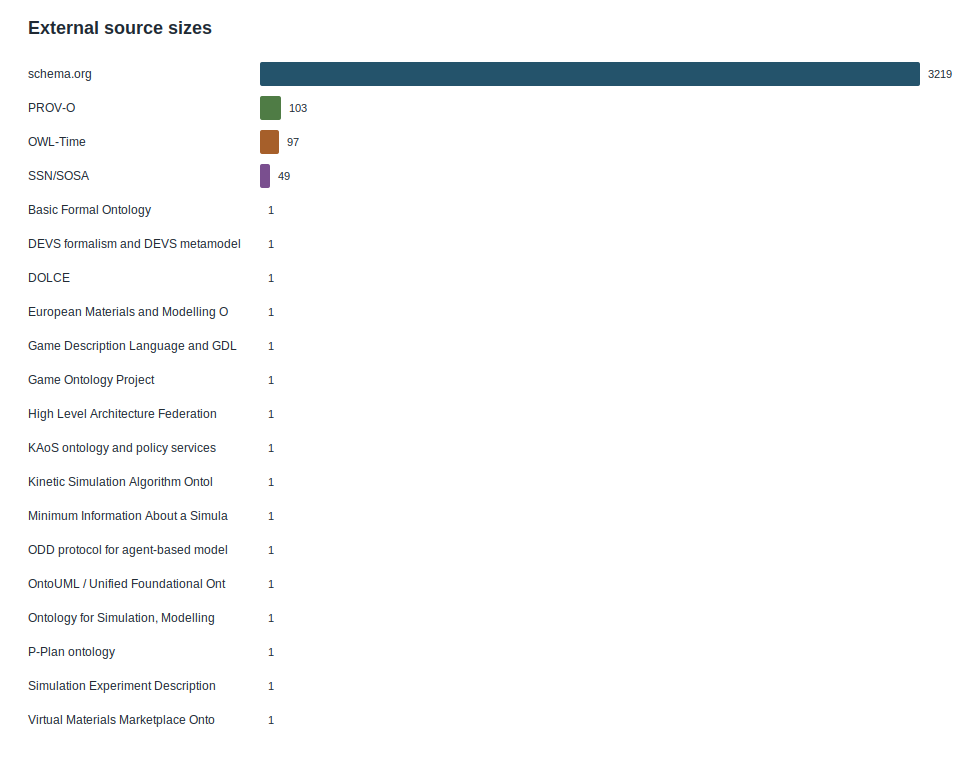
- 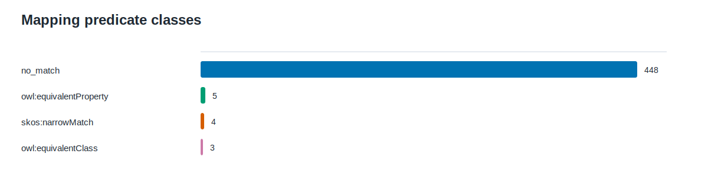
- 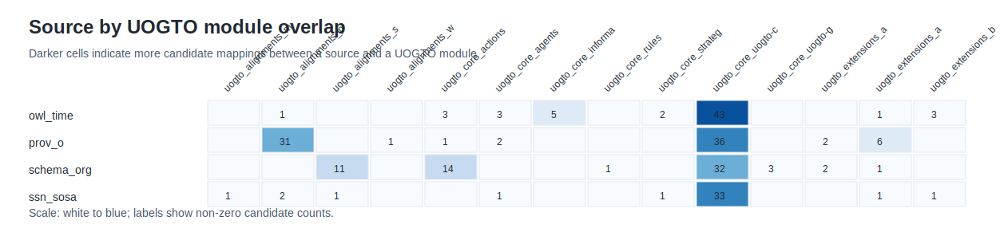
- 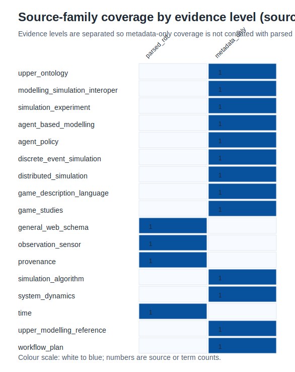
- 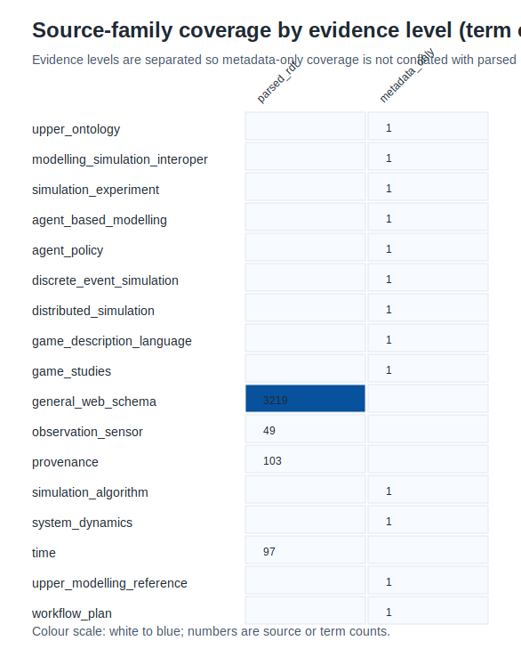
- 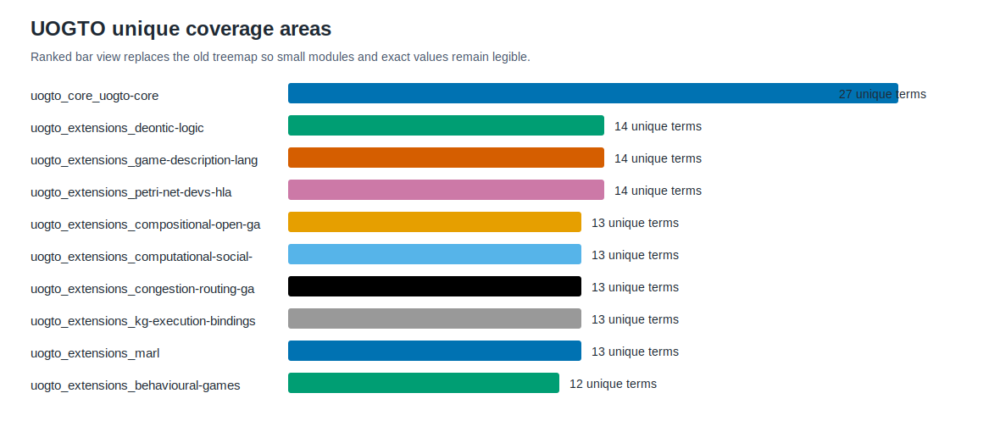
- 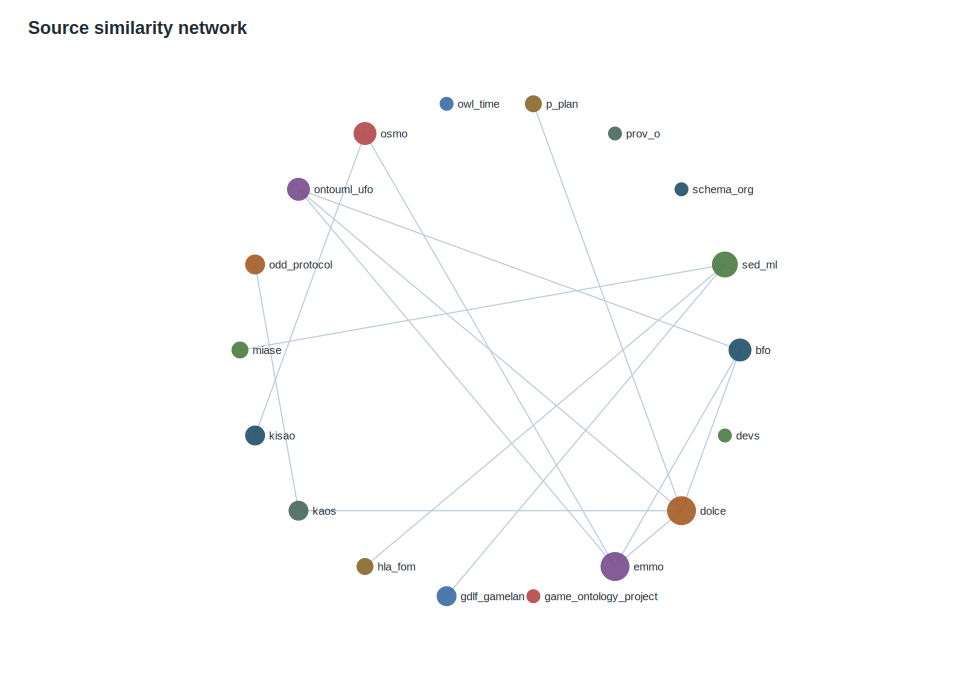
- 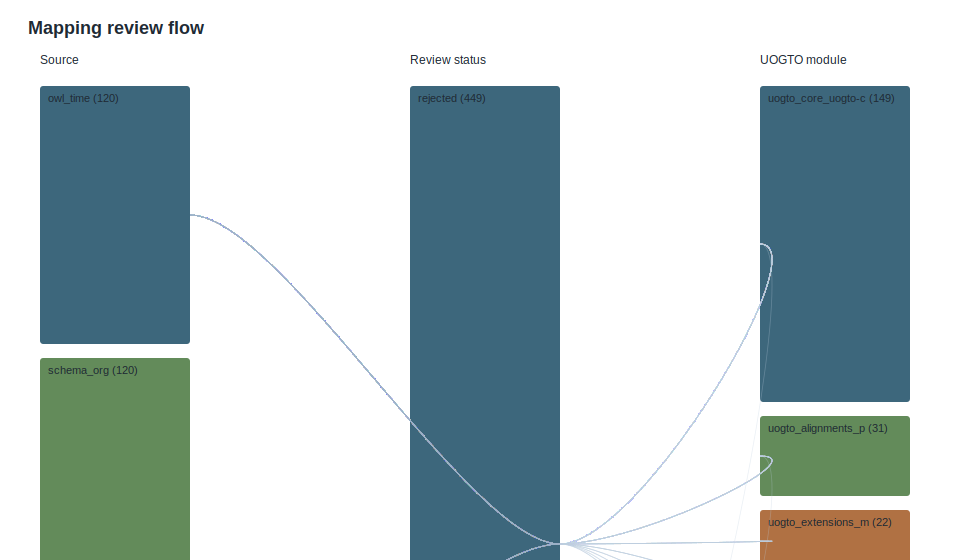
- 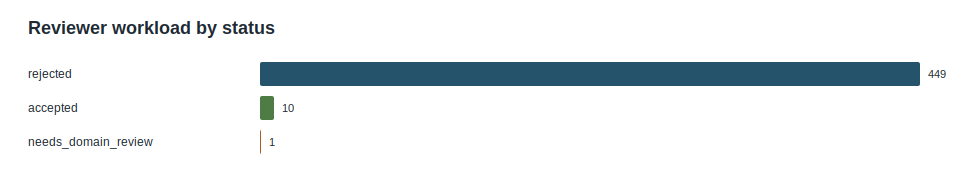

## Cosmograph Network Images and Interactive Exports
Cosmograph-ready node and edge CSV files are generated under `docs/ontology-comparison/cosmograph/`, alongside static SVG renderings for arXiv-safe review:

- 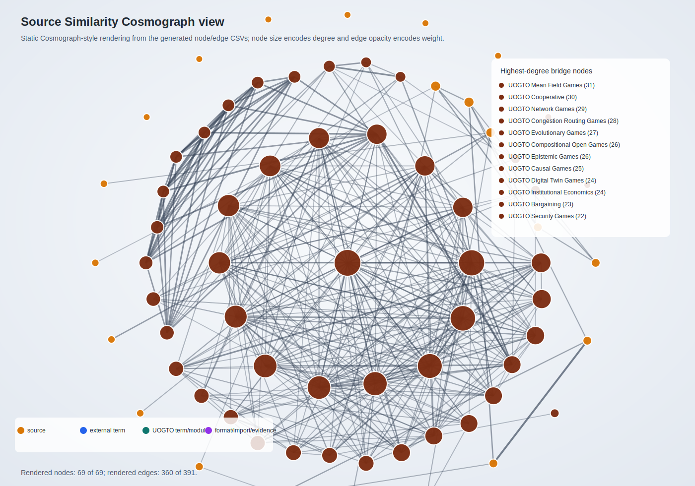
- 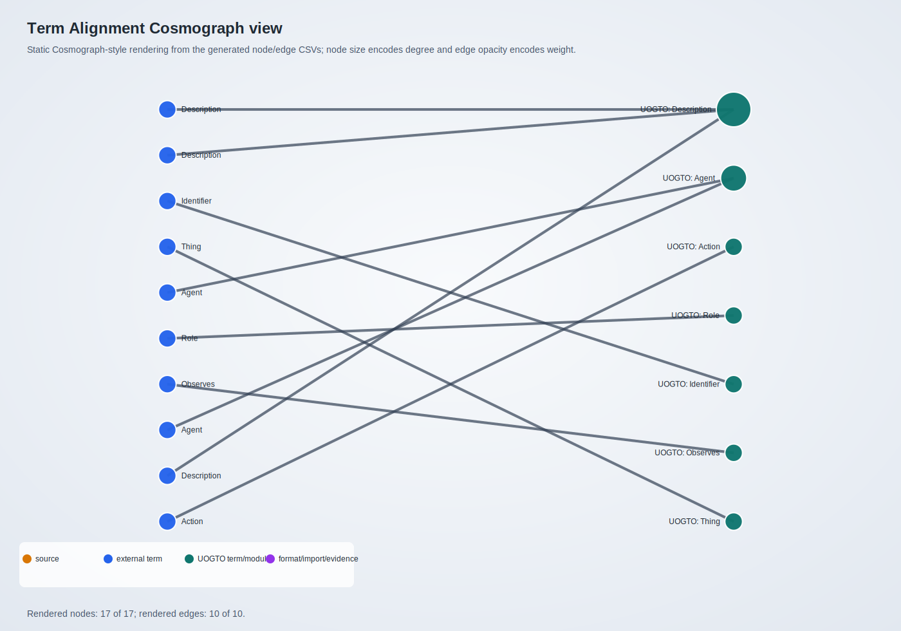
- 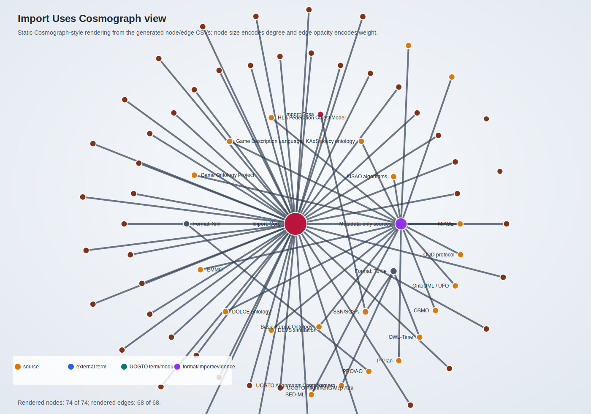

Use the `source` and `target` columns from each `*_edges.csv` file as links, join the matching `*_nodes.csv` file on `id`, and use `weight`, `kind`, and `degree` for link strength, colour, and size.

## Recommended UOGTO Follow-Up Work
1. Treat accepted mappings as stable crosswalk evidence and keep `accepted-alignments.ttl` in sync with any future review edits.
2. Prioritise high-volume unmatched sources as candidate extension-review areas rather than immediate equivalence assertions.
3. Use `needs_domain_review` mappings as reviewer work queues for ontology architects and domain experts.
4. Keep metadata-only standards separate from parsed RDF sources until their licences and formal artifacts permit stronger comparison.
5. Re-run `make ontology-comparison-visuals` after any source, mapping, overlap, or network artifact changes.

## Reproducibility
Run `make ontology-comparison-visuals` to regenerate this report and the SVG figures from the JSON/CSV artifacts. The report intentionally separates accepted alignments from candidates and future-work recommendations.
